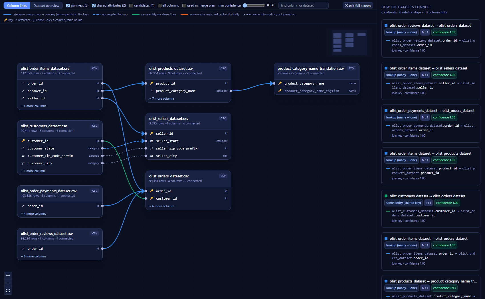
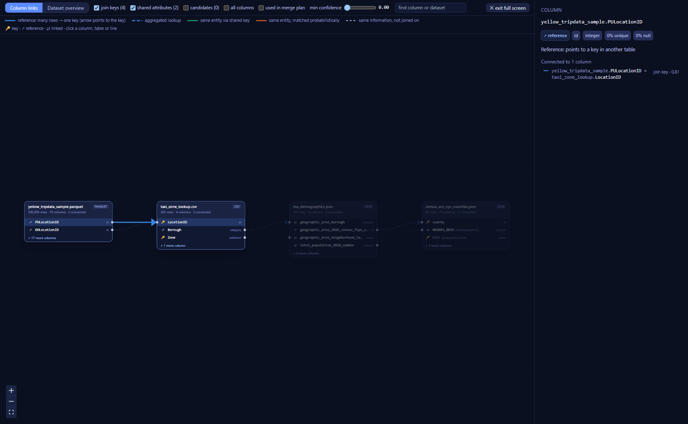
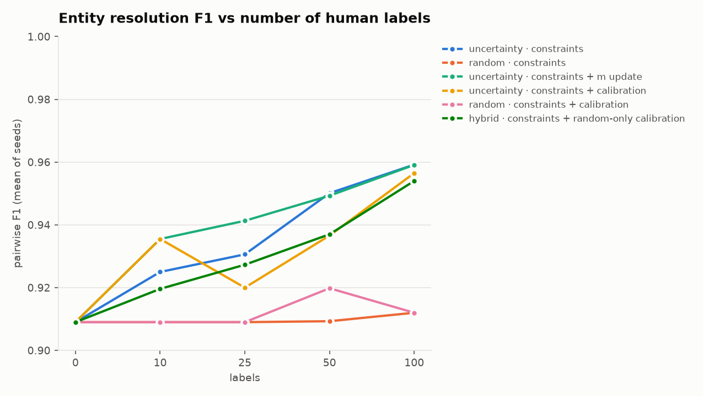
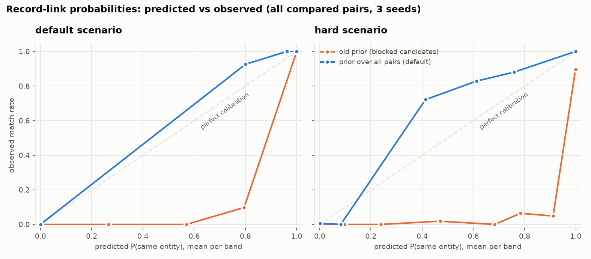

# GraphFusion

**Conversational multi-format dataset integration with graph-based schema matching, entity resolution and provenance-tracked merging.**

You upload datasets that were never designed to fit together (CSV, JSON, JSONL, Parquet, Excel, SQLite, REST). GraphFusion works out how they relate, which columns and records refer to the same things, and how they should be combined. It then executes a validated, fully traceable merge. Each decision comes with its evidence.

```text
User: Merge them, but only matches above 95% and prefer the most recent values.
  → set_preferences(confidence_threshold=0.95, conflict_strategy="prefer_latest")
  → execute_merge()
```

---

## Contents

1. [Problem statement](#1-problem-statement)
2. [Motivation](#2-motivation)
3. [Architecture](#3-architecture)
4. [Algorithms](#4-algorithms)
5. [Graph formulation](#5-graph-formulation) (5.4 schema map)
6. [Schema matching](#6-schema-matching) (6.9 robustness rules, 6.10 value crosswalks)
7. [Entity resolution](#7-entity-resolution) (7.1 adaptive blocking, 7.6 calibrated probabilities)
8. [Merge planner](#8-merge-planner)
9. [Conflict resolution and provenance](#9-conflict-resolution-and-provenance) (9.4 bitemporal history, 9.5 uncertainty and scenarios)
10. [Chatbot architecture](#10-chatbot-architecture) (10.1 rate limits)
11. [Installation](#11-installation)
12. [Running locally: command reference](#12-running-locally-command-reference)
13. [Running with Docker](#13-running-with-docker)
14. [Downloading demo data](#14-downloading-demo-data)
15. [Running the real-world example](#15-running-the-real-world-example)
16. [API documentation](#16-api-documentation)
17. [Evaluation](#17-evaluation)
18. [Benchmark results](#18-benchmark-results)
19. [Build and verification log](#19-build-and-verification-log)
20. [Limitations](#20-limitations)
21. [Future work](#21-future-work)

---

## 1. Problem statement

Organisations hold the same real-world things (customers, trips, places) in many independently built systems:

| System | Columns |
|---|---|
| CRM export (CSV) | `customer_id, customer_name, city, email, phone, signup_date` |
| Master data service (JSON) | `cust_no, full_name, location, email_address, phone_number, last_updated` |
| Point of sale (Parquet) | `txn_id, cust_id, amount_spent ('₹1,200'), txn_date` |

Names differ, types differ, identifiers come from different id spaces (`1024` vs `C-50123`), values are written differently (`Bangalore`/`Bengaluru`, `+91-98765-43210`/`9876543210`), dates mix formats, amounts mix currencies, rows are duplicated, keys are orphaned, and attributes conflict.

The question is: **which datasets can be merged, which columns correspond, which records are the same entity, and how should the unified dataset be built — without silently losing or overwriting anything?**

## 2. Motivation

`pandas.concat`/`merge` answers none of that. It assumes someone already knows the join keys, the column mapping, the value equivalences and the conflict policy. In practice a data engineer works these out by hand, and the reasoning behind each choice rarely gets written down.

GraphFusion turns that work into an explicit, inspectable pipeline:

* matching evidence is **measured** (names, types, values, distributions, formats, semantics) rather than guessed;
* relationships between datasets live in a **graph**, and graph algorithms decide the join structure;
* record linkage is **probabilistic** with learned parameters;
* conflicts are **recorded, not overwritten**;
* every output column, row and fused cell has **lineage**;
* a chat interface turns requests into **validated backend operations**, and the LLM never runs code.

## 3. Architecture

```text
 Next.js chat UI  ──►  FastAPI (REST + /chat)  ──►  Session orchestrator
                                                     │
          ┌──────────────────────────────────────────┼──────────────────────────────┐
          ▼                          ▼               ▼                              ▼
   Ingestion engine           Profiling engine   Schema matcher            Entity resolution
   format detection,          DuckDB statistics, candidates (LSH),         blocking, Fellegi–Sunter
   lossless readers,          semantic types,    7-signal scoring,         + EM, correlation
   immutable copies           bottom-k sketches  similarity flooding,      clustering
                                                  bipartite alignment
                                                     │
                                                     ▼
                                  Integration graph (datasets, columns, entities,
                                  typed weighted edges with evidence)
                                                     │
                     Graph algorithms: components · max spanning tree · Dijkstra (−log c)
                                                     │
                                                     ▼
                 Merge planner ──► static projection (exact output schema + lineage)
                                                     │
                                                     ▼
            Merge executor (DuckDB views, role-aware lookups, aggregation, entity fusion)
                                                     │
                     ┌───────────────────────────────┼─────────────────────────────┐
                     ▼                               ▼                             ▼
                Validation                      Provenance                     Export
          (row conservation, no fan-out,   (column / row / cell lineage,  (Parquet, CSV, reports,
           checksums, entity assignment)    W3C PROV-JSON)                  graph, mappings)
```

Session state (datasets, decisions, labels, crosswalks, merges, chat) is written to `workspace/sessions/<id>/session_state.pkl` after every successful change and restored on first use after a restart. With `DFG_API_TOKENS` set, every request needs a bearer token and sessions belong to the user who created them.

The code layout follows these stages:

```text
backend/
  ingestion/  profiling/  matching/  entity_resolution/  graph/  merge/  conflicts/
  provenance/  validation/  llm/  storage/  session/  api/  core/  main.py
frontend/     Next.js 14 · TypeScript · Tailwind · React Flow
scripts/      sample data generator, public-data downloaders, headless demo
experiments/  ablation, entity-resolution evaluation, graph experiment, LLM command benchmark, performance benchmark
tests/        22 test modules (unit, integration, API, end-to-end)
config/       weights & thresholds, value maps, abbreviations/thesaurus, glossary, FX rates
docs/         architecture, algorithms, math, API, evaluation, limitations
```

Details: [docs/architecture.md](docs/architecture.md).

## 4. Algorithms

Every algorithm in the system, the problem it solves, and where it lives:

| # | Problem | Algorithm | Module | Why this one |
|---|---|---|---|---|
| 1 | Lossless CSV typing | Two-pass type promotion (all values must cast, integer-literal regex) | `ingestion/readers.py` | Sample-based sniffers fail on mixed date formats and silently round `11.5` to `12` |
| 2 | Scalable value overlap | Coordinated bottom-$`k`$ (KMV) sketches + MinHash | `profiling/sketches.py` | $`O(k)`$ memory per column; unbiased Jaccard/containment estimates |
| 3 | Semantic types | Regex/gazetteer rates + statistical signatures + name priors, argmax | `profiling/semantic_types.py` | Value evidence dominates names |
| 4 | Candidate column pairs | MinHash **LSH Ensemble** (containment) ∪ name-token index ∪ semantic buckets | `matching/candidates.py` | Sub-quadratic; containment finds small keys from large FK columns |
| 5 | Column similarity | Weighted 7-signal score | `matching/scorer.py` | D3L-style multi-evidence matching |
| 6 | Value equivalence | Data-driven normaliser selection + chance-adjusted integer containment | `matching/value_sim.py` | Joins run under the equivalence that justified them; removes coincidental numeric overlap |
| 7 | Score refinement | **Similarity flooding** (fixpoint, multi-dataset adaptation) | `matching/similarity_flooding.py` | Two-hop and structural context; competition damping |
| 8 | 1:1 alignment | **Hungarian algorithm** (max-weight bipartite matching) + FK re-admission | `matching/aligner.py` | Globally optimal under the one-to-one constraint |
| 9 | Dataset relationships | Typed relationship inference (lookup / key merge / ER / aggregate) | `graph/relationships.py` | Decides *how* two datasets combine |
| 10 | Integration ecosystems | **Connected components** | `graph/algorithms.py` | Reachability under confident edges |
| 11 | Join structure | **Maximum spanning tree** (Kruskal) | `merge/planner.py` | Acyclic → no double counting; max total confidence |
| 12 | Integration routes | **Dijkstra** on $`-\log c`$ + **Yen's k-shortest paths** | `graph/algorithms.py` | Maximum-reliability path, with alternatives |
| 13 | Record-pair candidates | **Blocking**: standard keys, token keys, sorted neighbourhood | `entity_resolution/blocking.py` | Avoids $`O(n^2)`$ comparisons (99.1% avoided on sample data) |
| 14 | Match probability | **Fellegi–Sunter** + rule-blocked **EM** | `entity_resolution/fellegi_sunter.py` | Unsupervised probabilistic linkage without the degenerate EM solution |
| 15 | Entity clusters | **Correlation clustering** via greedy additive edge contraction (GAEC) | `entity_resolution/clustering.py` | Prevents transitive over-merging |
| 16 | Optional 1:1 linkage | Maximum-weight matching (NetworkX) | `entity_resolution/resolver.py` | One record per source per entity |
| 17 | Conflicts | Majority, priority, recency, confidence, **truth discovery**, keep-all, manual review | `conflicts/strategies.py` | Data-fusion strategies, all recorded |
| 18 | Aggregation | Functional-dependency pass-through ($`\lvert \mathrm{distinct}\rvert  \le 1 \Rightarrow`$ keep value) | `merge/executor.py` | Stops county-level figures being summed per neighbourhood |
| 19 | Execution | Lazy DuckDB views + subtree memoisation + streaming Parquet | `merge/executor.py` | Memory bounded by the engine limit; shared dimensions computed once |
| 20 | Learned column scorer (optional) | **Gradient-boosted trees + isotonic calibration**, user decisions as weighted labels | `matching/learned.py` | Learns from approve/reject; evaluated honestly (not default, §6.8) |
| 21 | Human-in-the-loop linkage | **Margin (uncertainty) sampling** + random calibration samples; must/cannot-link constraints; **semi-supervised Platt scaling** | `entity_resolution/resolver.py`, `clustering.py`, `fellegi_sunter.py` | Few labels fix boundary decisions; unbiased labels recalibrate (§7.5) |
| 22 | Attribute history | **Validity intervals** from timestamped candidates (run-length over time) | `merge/temporal.py` | Conflicts that are really changes over time become queryable history (§9.4) |
| 23 | Uncertain aggregates | **Bernoulli uncertainty propagation**: $`\sum p x`$, $`\sum p(1-p)x^2`$, normal interval | `provenance/uncertainty.py` | Shows how much of a figure rests on uncertain links (§9.5) |

Research grounding: Aurum (ICDE'18), D3L (ICDE'20), Valentine (ICDE'21), Similarity Flooding (ICDE'02), Cupid (VLDB'01), LSH Ensemble (VLDB'16), JOSIE (SIGMOD'19), Fellegi–Sunter (JASA 1969), Merge/Purge sorted neighbourhood (SIGMOD'95), GAEC (ICCV'15), Bleiholder & Naumann data fusion (CSUR'08), Dong et al. truth discovery (VLDB'09), W3C PROV-O, Platt scaling (1999) and isotonic calibration (Zadrozny & Elkan, KDD'02), active learning for ER (Sarawagi & Bhamidipaty, KDD'02), probabilistic databases (Dalvi & Suciu, VLDB'04), temporal data models (Snodgrass). More detail: [docs/algorithms.md](docs/algorithms.md), [docs/math.md](docs/math.md).

## 5. Graph formulation

### 5.1 The integration graph

```math
G = (V, E), \qquad V = \mathcal{D} \cup \mathcal{C} \cup \mathcal{N} \cup \mathcal{O}
```

with datasets $`\mathcal{D}`$, columns $`\mathcal{C}`$, entities $`\mathcal{N}`$ and outputs $`\mathcal{O}`$. Each edge $`e \in E`$ has a relationship type in {`contains`, `similar_column`, `foreign_key_candidate`, `value_overlap`, `semantic_match`, `dataset_relationship`, `same_entity`, `derived_from`}, an evidence payload, and a confidence

```math
c : E \rightarrow [0, 1].
```

### 5.2 Edge cost and shortest paths

```math
\mathrm{cost}(e) = -\log c(e) \quad \text{(default)} \qquad\text{or}\qquad \mathrm{cost}(e) = 1 - c(e) \quad \text{(config: graph.path\_cost)}
```

Treating edge confidences as independent evidence, the reliability of a path $`P = (e_1, \dots, e_k)`$ is

```math
\rho(P) = \prod_{i=1}^{k} c(e_i).
```

Because $`-\log`$ is strictly decreasing and $`-\log c \ge 0`$ for $`c \in (0, 1]`$,

```math
P^{*} = \arg\min_{P} \sum_{i} -\log c(e_i) = \arg\max_{P} \rho(P),
```

so Dijkstra returns the **maximum-reliability** route exactly, in $`O\big((|V| + |E|)\log|V|\big)`$.

**Why not $`1 - c`$?** Three hops of 0.8 cost $`0.60`$ with $`\rho = 0.512`$, while one direct 0.45 edge costs $`0.55`$ with $`\rho = 0.45`$. Linear cost picks the less reliable direct edge; $`-\log`$ costs are $`0.669 < 0.799`$ and pick the path. `tests/test_graph.py` asserts this case.

```text
Algorithm BEST-ROUTE(G, s, t, mode)
  H ← dataset view of G with edges c ≥ threshold
  for each edge e in H: cost(e) ← −log c(e)   (or 1 − c(e))
  P ← DIJKSTRA(H, s, t, cost)
  ρ ← Π c(e) over e ∈ P
  alternatives ← first k paths of YEN-K-SHORTEST(H, s, t, cost)
  return P, ρ, direct confidence c(s,t) if it exists, alternatives
```

### 5.3 Merge structure: maximum spanning tree

Among relationships above the mode threshold, the join structure is

```math
T^{*} = \arg\max_{T \,\text{spanning forest}} \sum_{e \in T} c(e).
```

A tree has exactly $`n - 1`$ edges per component. Any excluded edge would close a cycle, which means two join routes between the same datasets and rows counted twice. Kruskal solves this exactly in $`O(|E| \log |E|)`$.

```text
Algorithm PLAN-STRUCTURE(G, mode)
  H ← dataset relationships with c ≥ min_edge(mode)          ▷ others reported as excluded
  components ← CONNECTED-COMPONENTS(H); main ← largest (or the one with the pinned key)
  T ← KRUSKAL-MAXIMUM-SPANNING-TREE(H[main])
  for each edge (u,v) ∈ H[main] \ T:
      report excluded, with replacing path in T and its reliability ρ
  root ← pinned-key dataset, else largest dataset never on the dimension side of a lookup
  BFS from root; orient each edge (parent → child) and assign an operation (§8)
```

### 5.4 Schema map (what the Graph tab shows)

`backend/graph/schema_map.py` turns the session's profiles, scored matches, relationships and merge plan into an ER-style map. It is computed from the data, with no dataset-specific rules.

* **Tables** list every column with a role:
  * 🔑 key: strictly unique, not a measure, text or timestamp;
  * ↗ reference: the referencing side of a join key;
  * ⇄ linked: holds the same information as a column elsewhere;
  * · not connected.

  Glossary names (`config/glossary.yaml`) are shown next to opaque codes when available.
* **Links** connect the exact columns:
  * join keys are solid and coloured by relationship family: reference (blue), same entity by shared key (aqua), probabilistic entity match (orange);
  * aggregated lookups are dashed;
  * shared attributes are dashed grey;
  * candidates are dotted and hidden by default.

  The three colours pass the colour-blind and contrast checks on the app's dark surface, and every line also has a text label or list entry.
* **Layout** is Sugiyama-style:
  1. every relationship is directed from the referencing side to the referenced side (entity merges: larger → smaller);
  2. cycles are broken at the weakest edge;
  3. layer = longest path, so facts sit left and dimensions right;
  4. barycenter sweeps order tables within layers;
  5. each connected component gets its own block, and datasets with no relationship are listed separately.
  Formally, with directed relationship edges $`E`$ after cycle breaking, the layer of table $`v`$ and its position in the next sweep are:

  ```math
  \lambda(v) = \max\big(\{0\} \cup \{\lambda(u) + 1 : (u, v) \in E\}\big), \qquad
  \beta(v) = \frac{1}{\lvert N_{\ell\pm1}(v)\rvert} \sum_{u \in N_{\ell\pm1}(v)} \pi(u)
  ```

  Here $`\pi(u)`$ is the current position of neighbour $`u`$ in the adjacent layer. Tables in a layer are sorted by $`\beta`$, alternating downward and upward sweeps, which reduces edge crossings.
* **Interaction:**
  * **Selection:** click a column to highlight everything it connects to, a line to see its evidence (including the row check below), or a table to list its relationships. Everything else dims.
  * **Controls:** filters for link type, minimum confidence, "used in merge plan" and all columns, plus search, full screen and a minimap.
  * **Accessibility:** the side panel always lists every connection as text.



*Olist, 8 tables: every line connects the two columns it joins; arrows point to the referenced key (N : 1).*



*NYC: selecting `PULocationID` isolates its link to `taxi_zone_lookup.LocationID`; the side panel shows the column's role, uniqueness and connections.*

## 6. Schema matching

### 6.1 Score

For a candidate pair of columns $`c_i, c_j`$ from different datasets:

```math
S(c_i, c_j) = \frac{w_N N + w_T T + w_E E + w_V V + w_D D + w_P P + w_C C}{w_N + w_T + w_E + w_V + w_D + w_P + w_C}
```

Weights come from `config/config.yaml` (default $`w_N{=}0.20,\ w_T{=}0.10,\ w_E{=}0.20,\ w_V{=}0.25,\ w_D{=}0.05,\ w_P{=}0.10,\ w_C{=}0.10`$) and are renormalised over whichever signals are enabled; that is how the ablation switches signals off. If both columns have confident but incompatible semantic types (EMAIL vs DATE), $`S \leftarrow 0.6\,S`$.

### 6.2 The seven signals

**Name similarity $`N`$.** Names are split on snake/camel/digit boundaries and abbreviations are expanded (`cust_no` → customer number, `PULocationID` → pickup location identifier). With token lists $`t_i, t_j`$ and a weighted Monge–Elkan score

```math
\mathrm{ME}(a, b) = \frac{\sum_{x \in a} \omega(x)\, \max_{y \in b} \widetilde{\mathrm{JW}}(x, y)}{\sum_{x \in a} \omega(x)}, \qquad
\omega(x) = \begin{cases} 0.5 & x \text{ generic (id, name, date, …)} \\ 1 & \text{otherwise} \end{cases}
```

where $`\widetilde{\mathrm{JW}}`$ is Jaro–Winkler with values below 0.8 halved,

```math
N = \max\!\Big( \tfrac{1}{2}\big[\mathrm{ME}(t_i,t_j) + \mathrm{ME}(t_j,t_i)\big],\ \ 0.9\,\mathrm{JW}(\text{joined})\ [\mathrm{JW} > 0.85],\ \ 0.95\,\mathrm{TSR}\ [\mathrm{TSR} > 0.8] \Big).
```

**Type compatibility $`T`$.** A lookup lattice: identical 1.0, date~datetime 0.9, int~float 0.8, text~date 0.6, int~text 0.5, float~text 0.4, bool~int 0.4, bool~text 0.3, otherwise 0.1.

**Semantic similarity $`E`$.**

```math
E = 0.4\, J(\kappa_i, \kappa_j) + 0.3\, \sigma(\tau_i, \tau_j) + 0.3\, \cos(\mathbf{v}_i, \mathbf{v}_j)
```

$`\kappa`$ are thesaurus concept sets (Cupid-style synonyms: city ~ location ~ town). $`\sigma`$ is semantic-type compatibility (1 same, 0.6 same family, 0.5 unknown, 0 conflicting). $`\mathbf{v}`$ embeds the document "expanded name | semantic type | top values" with character 3–5-gram TF-IDF (default) or Sentence-Transformers (optional).

**Value overlap $`V`$.** For coordinated samples $`A_i, A_j`$ and normaliser $`\nu`$:

```math
J_\nu = \frac{|\nu(A_i) \cap \nu(A_j)|}{|\nu(A_i) \cup \nu(A_j)|}, \qquad
\kappa^{\nu}_{ij} = \frac{|\nu(A_i) \cap \nu(A_j)|}{|\nu(A_i)|}
```

```math
\nu^{*} = \arg\max_{\nu \in \mathcal{N}(c_i, c_j)} \Big( 0.4\, J_\nu + 0.6 \max(\kappa^{\nu}_{ij}, \kappa^{\nu}_{ji}) - \mathrm{cost}(\nu) \Big)
```

$`\mathcal{N}`$ contains the applicable normalisers: basic, alnum, identifier (`C-00123` → 123, `005` → 5), digits (phones), geo (strip ", NY" / " County"), reference domains (Bangalore → Bengaluru, Kings County → Brooklyn), and composites `semantic:CITY`. The small-domain factor is

```math
f = \min\!\left(1, \frac{\log_2(1 + \min(|A_i|, |A_j|))}{\log_2 33}\right), \qquad V_{\text{raw}} = 0.4\, J_{\nu^*} + 0.6 \max(\kappa_{ij}, \kappa_{ji}).
```

For **integer domains**, containment expected by chance is the density of the target within the source's range:

```math
e_{ij} = \frac{\big|\{ v \in A_j : \min A_i \le v \le \max A_i \}\big|}{\max A_i - \min A_i + 1}, \qquad
\kappa^{\dagger}_{ij} = \max\!\left(0, \frac{\kappa_{ij} - e_{ij}}{1 - e_{ij}}\right)
```

```math
V = \begin{cases}
f \cdot \big(0.5\, V_{\text{raw}} + 0.5 \max(\kappa^{\dagger}_{ij}, \kappa^{\dagger}_{ji})\big) & \text{integer domains} \\
0.5\, f \cdot V_{\text{raw}} & \text{continuous measures} \\
(0.8 + 0.2 f) \cdot V_{\text{raw}} & \text{textual domains}
\end{cases}
```

This adjustment removed a false foreign key on real data: county FIPS codes $`\{1, 3, \dots, 123\}`$ are trivially contained in `LocationID` $`= 1..265`$.

**Distribution $`D`$** (quantiles $`q \in \{5, 25, 50, 75, 95\}`$, a 1-D Wasserstein proxy), **pattern $`P`$** and **cardinality $`C`$**:

```math
D = 1 - \frac{1}{5}\sum_{q} \frac{|Q_i(q) - Q_j(q)|}{\mathrm{range}}, \qquad
P = \cos(\mathbf{h}_i, \mathbf{h}_j), \qquad
C = \sqrt{\frac{\min(d_i, d_j)}{\max(d_i, d_j)}}
```

$`\mathbf{h}`$ is the histogram of value shapes (`C-8921` → `A-9`) and $`d`$ are distinct counts. For text columns $`D`$ is length similarity.

### 6.3 Coordinated bottom-k sketches

```math
\mathrm{KMV}_k(A) = \{ a \in \mathrm{distinct}(A) : h(a) \le h_{(k)} \}
```

Every column uses the same hash $`h`$, so two sketches are **coordinated**. Restricting both to $`\tau = \min(\tau_i, \tau_j)`$ gives consistent overlap estimates, which are exact when $`|\mathrm{distinct}(A)| \le k`$ ($`k = 20\,000`$).

### 6.4 Similarity flooding (multi-dataset adaptation)

Classic flooding needs intra-schema structure that flat tables lack, so propagation runs over the cross-dataset pair graph. For $`a \in A`$, $`b \in B`$ and base score $`s^0`$:

```math
T^{k}(a,b) = \max_{c \in X,\ X \notin \{A,B\}} s^{k}(a,c)\, s^{k}(c,b)
```

```math
\Sigma^{k}(a,b) = \operatorname{mean}_{\text{top-}3}\ \Big\{ \max_{b' \ne b} s^{k}(a',b') : a' \in A \setminus \{a\} \Big\}
```

```math
X^{k}(a,b) = \frac{s^{k}(a,b)}{\max\big(\max_{b'} s^{k}(a,b'),\ \max_{a'} s^{k}(a',b)\big)}
```

```math
s^{k+1}(a,b) = \mathrm{clip}_{[0,1]}\Big( s^0 + \alpha \max(0, T^{k} - s^0) + \beta \max(0, \Sigma^{k} - \mu) \Big) \cdot \big(X^{k}\big)^{\gamma}
```

with $`\alpha = 0.5`$, $`\beta = 0.15`$, $`\mu = 0.6`$, $`\gamma = 0.35`$. Supports only raise scores; exclusivity is the only term that lowers them.

```text
Algorithm SIMILARITY-FLOODING(s⁰, datasets)
  s ← s⁰
  repeat up to 10 times
      for each pair (a,b):
          T ← max over third-dataset columns c of s(a,c)·s(c,b)          ▷ two-hop support
          Σ ← mean of top-3 best alignments among siblings of a and b    ▷ table coherence
          X ← s(a,b) / max(best partner score of a, best partner score of b)
          s'(a,b) ← clip(s⁰ + α·max(0, T − s⁰) + β·max(0, Σ − μ)) · X^γ
      Δ ← max |s' − s|;  s ← s'
  until Δ < 10⁻³
```

### 6.5 Bipartite alignment

For each dataset pair $`(A, B)`$:

```math
\max_{x} \sum_{a \in A}\sum_{b \in B} S(a,b)\, x_{ab}
\quad \text{s.t.} \quad \sum_{b} x_{ab} \le 1,\ \ \sum_{a} x_{ab} \le 1,\ \ x_{ab} \in \{0,1\},\ \ S(a,b) \ge \tau
```

This is solved with the Hungarian algorithm (`scipy.optimize.linear_sum_assignment`). A non-assigned pair is re-admitted as `foreign_key_candidate` when

```math
\mathrm{uniq}(b) \ge 0.98 \ \wedge\ \kappa_{ab} \ge 0.9,
```

so `PULocationID` and `DOLocationID` can both map to `LocationID`.

### 6.6 Full matching pipeline

```text
Algorithm MATCH-SCHEMAS(profiles, sketches, strategy)
  pairs ← all cross-dataset pairs            if |pairs| ≤ 5000
          else LSH-ENSEMBLE(containment ≥ 0.3) ∪ NAME-TOKEN-INDEX ∪ SEMANTIC-BUCKETS
  fit TF-IDF embeddings on all column documents
  for (ci, cj) in pairs:  s⁰(ci,cj), evidence ← SCORE(ci, cj)            ▷ §6.1–6.2
  s ← SIMILARITY-FLOODING(s⁰)                    if strategy.flooding
  keep pairs with s ≥ 0.35
  HUNGARIAN-ALIGN per dataset pair, re-admit verified FK pairs    if strategy.bipartite
  return matches with score, band (HIGH ≥ 0.9, MEDIUM ≥ 0.7, LOW), evidence, decision
```

### 6.7 Dataset relationships

Accepted matches for a dataset pair are aggregated into one typed relationship. Key uniqueness is measured *net of exact duplicate rows*, $`\mathrm{uniq}^{*} = d / (n_{\text{non-null}} - n_{\text{dup rows}})`$, so an export glitch does not make a primary key non-unique.

| Kind | Condition | Confidence |
|---|---|---|
| `lookup` | keyish column or verified FK references a unique key; coverage $`\ge 0.8`$ (row-weighted when the whole value distribution is known) | $`0.7\,S_{\text{key}} + 0.3\,\text{coverage}`$ |
| `entity_key_merge` | both sides unique on the same id space, $`J \ge 0.3`$ | $`0.7\,S_{\text{key}} + 0.3\,J`$ |
| `entity_resolution` | $`\ge 2`$ descriptive matches including name/e-mail/phone, comparable table sizes | $`\overline{S}_{\text{top-3}} \times (0.95 \text{ or } 0.85)`$ |
| `aggregate_lookup` | shared non-unique categorical key, coverage $`\ge 0.8`$ | $`0.85\,(0.7\,S + 0.3\,\text{coverage})`$ |

The candidate with the highest confidence wins. Structural priority (key merge > lookup > ER > aggregate) only breaks ties within 0.05.

### 6.8 Learned column matcher (optional scorer)

A supervised alternative to the fixed weights: a gradient-boosted classifier over **20 features** of each scored column pair. The features are the 7 signals, Jaccard, two-way containment, the graph fields (base score, transitive and structural support, exclusivity), semantic-type compatibility, min/max uniqueness, the distinct-count ratio and type flags (`backend/matching/learned.py`).

```math
\hat p(\text{match} \mid x) = \mathrm{Iso}\big(f_{\mathrm{GBDT}}(x)\big), \qquad
S_{\text{learned}} = \hat p, \qquad S_{\text{blend}} = \tfrac12\big(S_{\text{weighted}} + \hat p\big)
```

$`f_{\mathrm{GBDT}}`$ is `HistGradientBoostingClassifier` (balanced class weights, $`\ell_2`$ = 1). Isotonic calibration (`CalibratedClassifierCV`, 3 folds) makes $`\hat p`$ a probability, so the existing 0.9 / 0.7 thresholds keep their meaning.

**Training** (`experiments/train_matcher.py`): 36 fabricated scenarios generated with seed 7777. The evaluation seed is 2026, and no sample or NYC data is used. That gives 5,249 candidate pairs (442 positives). Quality is estimated with `GroupKFold(5)` grouped by scenario, so no scenario appears in both training and test folds: out-of-fold AUC **0.9998**, Brier **0.0021**.

**Learning from the user.** Approve/reject decisions in the Mappings tab are extra labelled examples with weight $`\eta = 10`$:

```math
\min_f \sum_{i \in \text{base}} \ell\big(y_i, f(x_i)\big) + \eta \sum_{j \in \text{decisions}} \ell\big(y_j, f(x_j)\big)
```

`POST /integration/matcher/retrain` refits, saves the model to the session workspace, and marks discovery stale. Decided pairs are exempt from candidate pruning, so a rejection stays visible. In a test, one rejection moved `phone_number ↔ phone` from 0.96 to 0.21.

**Result (§17): it is not the default.** On the fabricated benchmark the learned scorer reaches F1 ≈ 0.99–1.00, versus 0.92–0.95 for the weighted graph pipeline. On real NYC data it drops to **0.400**, versus **0.769** for weighted. It learned the generator's regularities, not schema matching in general. `scorer: weighted` stays the default; `learned` and `blend` are selectable per session.

### 6.9 Guarding relationships against look-alikes (robustness rules)

Profile-level signals can make two different things look alike. On the real Olist data this produced three errors. `orders.customer_id` ↔ `reviews.review_id` was accepted with 0 shared values. `order_estimated_delivery_date` ↔ `review_creation_date` was accepted though they agree on only 1.5% of joined rows. And reviews ↔ orders was shown as 1:1, although 551 orders have several reviews. Each fix is a general rule tested on data, not a rule about names:

| Rule | Where | Test |
|---|---|---|
| **Token identifiers** are typed `ID` by value signature | `profiling/semantic_types.py` | one token of `[A-Za-z0-9_-]{12,64}`, letters *and* digits in > 90% of values, length spread ≤ 4 (hashes, UUIDs without dashes, base62); also for low-uniqueness foreign keys |
| **Identifiers are defined by their values** | `matching/matcher.py` → `aligner.align(vetoed=…)` | two `ID` columns with $`\max(\text{containment}) < 0.05`$ are vetoed *before* the Hungarian assignment, so they cannot take a column from its true partner |
| **Code prefixes are not stripped across identifier systems** | `matching/value_sim.py` | the `identifier` normaliser (`C-00123` ≡ `123`) is skipped when both columns are ≥ 80% coded with disjoint prefixes (`OR-…` vs `PR-…`) |
| **Same information must agree row by row** | `graph/verification.py` | for lookup / 1:1 key relationships, a sample of ≤ 20K referencing rows is joined on the key; an attribute pair is rejected when $`\text{agreement} < 0.5`$ (≥ 30 comparable rows required) |
| **1:1 needs strict uniqueness** | `graph/relationships.py` | `entity_merge_uniqueness: 0.999` on both keys; a key with repeats is a many-to-one reference |
| **The referenced side is the more unique side** | `graph/relationships.py` | when both columns pass the 0.98 key threshold, the less unique one is the reference |
| **No sibling joins (fan trap)** | `relationships.drop_implied_sibling_links` | an X—Y link where both columns reference the same strictly unique key Z.z is removed: X and Y connect through Z |

```math
\text{agreement}(x, y) = \frac{\lvert\{(r, s) \in R \bowtie_{k} S : \nu(r.x) = \nu(s.y)\}\rvert}{\lvert\{(r, s) \in R \bowtie_{k} S : r.x \neq \bot,\ s.y \neq \bot\}\rvert}
```

$`\nu`$ is the match's own normaliser. Numbers compare with a relative tolerance, and timestamps at the precision both sides share.

**Evaluation** (`experiments/run_schema_robustness.py`): 80 generated schemas with meaningless names and four identifier formats. Traps include disjoint identifiers of identical format, look-alike dates, a near-unique child reference, sibling tables and overlapping integer ranges.
- **Result:** 80/80 fully correct, with 0 missed or extra relationships, 0 wrong N:1 directions and 0 false identifier links.
- **Before the last two rules:** prefixed codes missed 4 of 5 relationships and integer keys reversed the N:1 direction.
- **Caveat:** the generator was written together with these rules and uses one star-schema shape, so it guards against known failure modes rather than proving general correctness.
- **Regressions:** the schema-matching ablation (§17) is unchanged (identical P/R/F1 on all five benchmark sets), and both demos pass.

### 6.10 Value crosswalks (LLM-proposed, verified on the data)

Some columns describe the same things with **different vocabularies**: `CA` vs `California`, `DEU` vs `Germany`, `Manhattan` vs `New York County`. Names, formats and value overlap cannot connect them, and a static value map only covers what someone wrote down. `backend/matching/crosswalk.py` lets the language model propose the mapping but never trusts it:

```text
Algorithm CROSSWALK(profiles, sketches, first matching pass)
  P ← pairs of text columns from different datasets with
        complete value sketches, 3 ≤ |values| ≤ 400 (smaller side ≤ 80),
        not ID/e-mail/phone/date/number/…, not already accepted,
        value containment < 0.5 (otherwise no crosswalk is needed)
  keep the 6 pairs with the highest first-pass score
  for (A, B) in P:
      M ← LLM({distinct values of A}, {distinct values of B})     ▷ cached by the value lists: repeats cost no tokens
      verify M (below); if accepted: register normaliser "crosswalk:<id>" for the pair (A, B) only
  if any accepted: re-run schema matching; scorer uses the crosswalk normaliser for those pairs
```

The model's mapping $`M : V_A \to V_B \cup \{\bot\}`$ is accepted only if

```math
\frac{\lvert\{a : M(a) \notin V_B\}\rvert}{\lvert M \rvert} \le 0.2, \qquad
\text{coverage} = \frac{\lvert\{a : M(a) \in V_B\}\rvert}{\lvert V_A \rvert} \ge 0.5, \qquad
\text{injectivity} = \frac{\lvert M(V_A) \rvert}{\lvert\{a : M(a) \in V_B\}\rvert} \ge 0.8
```

with at least two non-trivial pairs. Hallucinated values are counted, not silently dropped. An accepted crosswalk does not create a match by itself: the value-overlap and pattern signals are measured *after* mapping, and the ordinary 7-signal score, alignment, row-level verification (§6.9) and relationship inference still decide. Crosswalks are saved with the session. Config: `schema_matching.crosswalk` (off without a real LLM provider).

**Measured** (`experiments/run_crosswalk.py`, mapping produced by the live model, no static map covering these vocabularies):

| Scenario | Crosswalk | Correspondence found | False links | Proposed / verified | Dataset relationship |
|---|---|---|---|---|---|
| US state codes ↔ names | off | 0 / 1 | 0 | — | none |
| US state codes ↔ names | on | **1 / 1** | 0 | 1 / 1 | lookup 0.78 |
| ISO country codes ↔ names | off | 0 / 1 | 0 | — | none |
| ISO country codes ↔ names | on | **1 / 1** | 0 | 1 / 1 | lookup 0.74 |
| month names ↔ abbreviations | off | 0 / 1 | 0 | — | none |
| month names ↔ abbreviations | on | **1 / 1** | 0 | 1 / 1 | lookup 0.76 |
| negative control (colours vs weekdays) | on | 0 / 0 | 0 | 1 / **0** (rejected) | none |

On NYC it adds nothing: the borough ↔ county map in `config/value_maps.yaml` already covers that pair. The 80 robustness schemas (§6.9) stay 80/80 with crosswalks on.

## 7. Entity resolution

### 7.1 Blocking

```text
Algorithm BLOCK(records, fields)
  C ← ∅
  for field f with semantic type EMAIL / PHONE / ID:     group by normalised value;  add intra-block pairs
  for NAME fields:                                        group by "surname|first-initial"; add pairs
  sort by "surname firstname"; add pairs within a sliding window of 5   ▷ sorted neighbourhood
  skip (and count) any block larger than 2000
  return C
```

The reduction ratio is $`1 - |C| / \binom{n}{2}`$: **99.1%** on the sample (4,391 of 504,510 pairs compared).

**Adaptive block refinement.** A name-token key such as `sharma|r` does not get more selective as data grows, so its blocks, and the pairs they produce, grow quadratically. A token block larger than `refine_block_size` (150) is split by a second key before pairs are generated: first by the normalised value of a location/category field (keeps "R. Sharma" and "Rahul Sharma" in the same city together), then, only if still too large, by the full first name. E-mail, phone and id blocks are not refined, so exact identifiers still link across cities.

```text
REFINE(block B, keys [city/category…, first name], limit)
  parts ← [B]
  for key in keys while some part > limit:
      replace each part > limit by its groups under key   ▷ records without a value form their own group
  return parts
```

Measured on the customer scenario at growing sizes (`experiments/run_er_scaling.py`, single process; `--no-refine` for the baseline):

| Entities | Records | Refinement | Candidate pairs | Time | Peak RSS | Pairwise F1 |
|---|---|---|---|---|---|---|
| 10,000 | 16,569 | off / on | 416,738 / 416,738 | 8.4 s / 11.0 s | 707 MB | 0.988 / 0.988 |
| 40,000 | 66,028 | off | 6,512,936 | 188.9 s | 7,517 MB | 0.986 |
| 40,000 | 66,028 | **on** | **1,791,335** | **53.8 s** | **2,505 MB** | 0.981 |
| 100,000 | 164,985 | on | 5,109,474 | 170.3 s | 7,026 MB | 0.978 |

At 40K entities refinement cuts pairs 3.6×, time 3.5× and memory 3× for −0.005 F1; below ~10K entities no block exceeds the limit, so nothing changes. Pairs still grow slightly faster than linearly, so a single process tops out at roughly 150–200K entity records on 17 GB; beyond that ER would need partitioning (§21).

### 7.2 Fellegi–Sunter

Each candidate pair gets a comparison vector $`\gamma`$ with levels $`\ell_k \in \{\text{exact}, \text{high}, \text{medium}, \text{different}, \text{null}\}`$. Person names use token logic: "Rahul K Sharma" is high, "R. Sharma" medium, "Rohan Sharma" different.

```math
m_k(\ell) = P(\gamma_k = \ell \mid M), \qquad u_k(\ell) = P(\gamma_k = \ell \mid U)
```

```math
W(\gamma) = \log_2\frac{\lambda}{1-\lambda} + \sum_{k:\,\ell_k \ne \text{null}} \log_2\frac{m_k(\ell_k)}{u_k(\ell_k)}, \qquad
P(M \mid \gamma) = \frac{1}{1 + 2^{-W(\gamma)}}
```

$`u`$ is estimated from 4,000 uniformly random record pairs, which are almost all non-matches.

### 7.3 Rule-blocked EM

Plain EM over blocked pairs converged to a degenerate class ("shares a surname"): prior $`\lambda = 0.44`$ and pairwise F1 0.58. Instead, for every strong rule field $`r`$ (e-mail, phone, id, name):

```math
R_r = \{\gamma : \gamma_r \in \{\text{exact}, \text{high}\}\}
```

EM runs on $`R_r`$ using only the fields $`F \setminus \{r\}`$:

```math
\text{E-step:}\quad p_\gamma = P(M \mid \gamma_{F\setminus r})
```

```math
\text{M-step:}\quad m_k(\ell) = \frac{\sum_{\gamma \in R_r} p_\gamma\, \mathbb{1}[\gamma_k = \ell] + \tfrac{1}{2}}{\sum_{\gamma \in R_r} p_\gamma + 2}, \qquad \lambda = \frac{1}{|R_r|}\sum_{\gamma \in R_r} p_\gamma
```

The final $`m_k`$ is the $`|R_r|`$-weighted average over runs with $`k \ne r`$. Agreement levels never count against a match ($`m_k(\ell) \ge u_k(\ell)`$ for exact/high), and $`\lambda`$ is re-estimated over all candidates with $`m, u`$ fixed. Identical vectors are grouped, so each iteration costs $`O(\#\text{patterns})`$. Result: **F1 0.997**.

### 7.4 Correlation clustering (GAEC)

```math
w_{ij} = \mathrm{logit}(p_{ij}) - \mathrm{logit}(t) \quad (\text{compared pairs}), \qquad w_0 = -0.4 \quad (\text{uncompared pairs})
```

```math
\max_{\mathcal{P}} \sum_{C \in \mathcal{P}} \sum_{i < j \in C} w_{ij}, \qquad
W(C_1, C_2) = \sum_{i \in C_1,\, j \in C_2} w_{ij} + n_{\text{uncompared}}\, w_0
```

```text
Algorithm GAEC(records, links, t)
  every record is its own cluster; heap ← all cluster pairs with W > 0
  while heap not empty:
      (C1, C2) ← pair with largest W
      if W is stale: recompute and re-push; continue
      merge C2 into C1; add their adjacency weights; push updated W(C1, ·) > 0
  return clusters
```

An explicit strong non-match inside a candidate merge makes $`W`$ negative, which is exactly the constraint that connected components ignores. At threshold 0.5, precision is **0.988** with GAEC versus **0.879** with connected components.

### 7.5 Active learning (human-in-the-loop linkage)

After a merge, the **Review** tab (and the `review_entity_links` chat tool) lists record pairs to label; `label_entity_link` / `POST /integration/entities/label` stores a decision; the next merge applies it. Labels are used in two ways:

**1. Hard constraints.** In GAEC a must-link gets $`w_{ij} = +H`$ and a cannot-link $`w_{ij} = -H`$ with $`H = 10^6`$, so no amount of ordinary evidence overrides a human decision. Labelled pairs that blocking missed are added to the candidates.

**2. Recalibration of match weights.** Fellegi–Sunter weights are overconfident when fields are correlated. A semi-supervised Platt scaling refits $`P(M \mid \gamma) = \sigma(a\,W + b)`$ (uncalibrated: $`a = \ln 2, b = 0`$). It uses every compared pair with its current probability as a soft target, plus the labelled pairs as hard targets with weight $`\lambda = 20`$:

```math
\min_{a \in [0.01, 5],\; b \in [-30, 30]} \;\sum_{i \in \text{all}} \mathrm{CE}\big(\sigma(\ln 2 \cdot W_i),\, \sigma(a W_i + b)\big) \;+\; \lambda \sum_{j \in \mathcal{L}_{\text{rand}}} \mathrm{CE}\big(y_j,\, \sigma(a W_j + b)\big)
```

**Which labels may recalibrate.** Only $`\mathcal{L}_{\text{rand}}`$, the pairs that were shown as *uniformly random* samples. Pairs chosen by uncertainty sampling sit next to the decision boundary and are a biased sample of the weight distribution. Fitting a calibration to them collapsed recall in the experiment below (F1 0.856 → 0.711). The queue therefore mixes the two kinds:

```text
Algorithm REVIEW-QUEUE(result, k, t = auto-merge threshold, ρ = 0.3)
  for each compared pair (i, j) with probability p, not yet labelled:
      u ← exp(−|logit(p) − logit(t)|)                     ▷ margin to the merge boundary, in (0, 1]
      if clustering disagrees with p ≷ t: u ← u + 0.5       ▷ merged although p < t, or split although p ≥ t
  Q ← top (1 − ρ)·k pairs by u, tagged "uncertainty"       ▷ fix decisions: become constraints
  Q ← Q ∪ ρ·k uniformly random other pairs, tagged "random" ▷ unbiased: constraints + recalibration
  return Q
```

`entity_resolution.label_calibration: random_only | all | off` selects the behaviour. `label_weight` (default 0) optionally adds labelled matches to the $`m`$ estimates:

```math
m_k(\ell) = \frac{w_0\,\hat m_k(\ell) + \eta\,\sum_{\gamma \in \mathcal{L}_M}\mathbb{1}[\gamma_k=\ell]}{w_0 + \eta\,|\mathcal{L}_M|}
```

where $`\hat m_k`$ is the rule-blocked EM estimate, $`w_0`$ its total pair weight, and $`\mathcal{L}_M`$ the labelled matches. It is off by default: in the experiment it added only +0.004 F1.

**Result** (`experiments/run_active_learning.py`, hard variant with 60% of e-mails and phones missing, 3 seeds, oracle labels in batches of 10, calibrated probabilities with the balanced record-link threshold 0.5 from §7.6): mean pairwise F1 **0.909** with no labels (0.856 with the old prior and threshold 0.9).

| Selection · label use | 25 labels | 100 labels |
|---|---|---|
| uncertainty · constraints only | 0.931 | **0.959** |
| random · constraints only | 0.909 | 0.912 |
| uncertainty · + $`m`$ update | **0.941** | **0.959** |
| uncertainty · + calibration on all labels | 0.920 | 0.957 |
| random · + calibration | 0.909 | 0.912 |
| **hybrid (70/30) · + random-only calibration** (default) | 0.927 | 0.954 |

With the old, overconfident probabilities, calibrating on uncertainty-sampled labels collapsed F1 to 0.711. With calibrated probabilities it no longer does (0.957), and plain uncertainty sampling with constraints is best at 100 labels (0.959). The earlier collapse was a symptom of the miscalibration. The hybrid queue stays the default: within 0.005 of the best, and its random share keeps an unbiased label sample.



### 7.6 Calibrated linkage probabilities

Record-link probabilities drive the auto-merge decision, the Review queue and `_match_probability` in the uncertainty aggregates (§9.5), so they must mean what they say.

**The defect.** Fellegi–Sunter posterior odds factor into a prior and the evidence:

```math
\frac{P(M \mid \gamma)}{P(U \mid \gamma)} = \frac{\lambda}{1-\lambda} \cdot \prod_k \frac{m_k(\gamma_k)}{u_k(\gamma_k)}
```

$`u`$ is estimated from uniformly random pairs of the **whole population**, but $`\lambda`$ was estimated over the **blocked candidates** (≈ 5% matches instead of ≈ 0.1%). Mixing the two populations inflates the odds by roughly $`\binom{n}{2} / \lvert C \rvert`$ (about 50×, or 5.6 bits on the sample). On sparse data, pairs the old model rated 0.90–0.99 were real matches **4.9%** of the time.

**The fix.** $`\lambda`$ is re-estimated over all comparable pairs $`T`$ (cross-dataset plus within-dataset pairs of deduplicated groups), treating pairs outside the blocks as non-matches. It is the fixed point of

```math
\lambda = \frac{1}{T} \sum_{i \in C} \sigma_2\!\big(\operatorname{logit}_2 \lambda + \mathrm{LLR}_i\big), \qquad \mathrm{LLR}_i = \sum_k \log_2 \frac{m_k(\gamma_{ik})}{u_k(\gamma_{ik})}
```

It is solved by iteration from the candidate-set estimate (`fellegi_sunter.prior_over_all_pairs`; config `entity_resolution.prior_population: all_pairs`). $`m`$ and $`u`$ are unchanged.

**Measured** (`experiments/run_uncertainty.py`, 3 seeds; pair metrics over *all* compared pairs, merged metrics at each prior's threshold):

| Scenario | Prior | Pair ECE | Pair Brier | Pair log-loss | Merged: mean predicted | Merged: observed purity | 95% interval covers |
|---|---|---|---|---|---|---|---|
| default | old prior (blocked candidates) | 0.005 | 0.003 | 0.010 | 1.000 | 0.999 | 2/3 |
| default | **prior over all pairs** (default) | 0.001 | 0.001 | 0.002 | 0.994 | 0.999 | 2/3 |
| default | prior over all pairs + term frequencies | 0.001 | 0.001 | 0.003 | 0.991 | 0.999 | 1/3 |
| default | prior over all pairs + 30 random labels | 0.001 | 0.001 | 0.002 | 0.995 | 0.999 | 2/3 |
| hard | old prior (blocked candidates) | 0.093 | 0.077 | 0.258 | 0.992 | 0.881 | 0/3 |
| hard | **prior over all pairs** (default) | 0.016 | 0.017 | 0.061 | 0.807 | 0.954 | 0/3 |
| hard | prior over all pairs + term frequencies | 0.027 | 0.021 | 0.072 | 0.763 | 0.971 | 0/3 |
| hard | prior over all pairs + 30 random labels | 0.013 | 0.016 | 0.058 | 0.826 | 0.954 | 0/3 |



**Record-link thresholds.** The merge modes' 0.95 / 0.90 / 0.75 were tuned to the inflated probabilities. With calibrated probabilities a threshold can be read literally, so the modes got their own record-link thresholds:
- **strict** 0.90: near-certain matches only;
- **balanced** 0.50: more likely the same entity than not;
- **permissive** 0.35: favours recall.

Schema-level thresholds are unchanged. The values were set by that principle on seeds 7/11/23 and then checked on seeds 101/202/303 (`experiments/run_er_thresholds.py`):

| Scenario | Seeds | Setting | Record-link threshold | P | R | F1 |
|---|---|---|---|---|---|---|
| default | tuning (7, 11, 23) | old prior, old balanced | 0.90 | 0.999 | 0.997 | 0.998 |
| default | tuning (7, 11, 23) | calibrated, strict | 0.90 | 1.000 | 0.977 | 0.988 |
| default | tuning (7, 11, 23) | calibrated, balanced | 0.50 | 0.999 | 0.996 | **0.997** |
| default | tuning (7, 11, 23) | calibrated, permissive | 0.35 | 0.999 | 0.997 | 0.998 |
| default | held-out (101, 202, 303) | old prior, old balanced | 0.90 | 0.999 | 0.999 | 0.999 |
| default | held-out (101, 202, 303) | calibrated, strict | 0.90 | 1.000 | 0.979 | 0.989 |
| default | held-out (101, 202, 303) | calibrated, balanced | 0.50 | 0.999 | 0.999 | **0.999** |
| default | held-out (101, 202, 303) | calibrated, permissive | 0.35 | 0.999 | 0.999 | 0.999 |
| hard | tuning (7, 11, 23) | old prior, old balanced | 0.90 | 0.777 | 0.959 | 0.856 |
| hard | tuning (7, 11, 23) | calibrated, strict | 0.90 | 1.000 | 0.326 | 0.490 |
| hard | tuning (7, 11, 23) | calibrated, balanced | 0.50 | 0.922 | 0.898 | **0.909** |
| hard | tuning (7, 11, 23) | calibrated, permissive | 0.35 | 0.915 | 0.934 | 0.924 |
| hard | held-out (101, 202, 303) | old prior, old balanced | 0.90 | 0.834 | 0.968 | 0.895 |
| hard | held-out (101, 202, 303) | calibrated, strict | 0.90 | 1.000 | 0.358 | 0.526 |
| hard | held-out (101, 202, 303) | calibrated, balanced | 0.50 | 0.936 | 0.948 | **0.942** |
| hard | held-out (101, 202, 303) | calibrated, permissive | 0.35 | 0.932 | 0.949 | 0.940 |

**What did not help** (measured, not adopted):
- **Term-frequency adjustment of $`u`$** (Winkler): $`u_k(\text{exact} \mid v) = \mathrm{freq}(v)`$, so agreeing on a common name counts less. With the old prior it partly masked the defect; with the calibrated prior it worsens calibration and lowers sparse-data F1 @0.5 from 0.909 to 0.863. It stays available as `term_frequency: true`.
- **Recalibration from 30–60 labels:** uniform or probability-stratified samples with inverse-inclusion weights, fitted as a two-parameter logistic on $`\operatorname{logit} p`$. Merged-entity ECE only moved from 0.147 to 0.08–0.12. A monotone two-parameter map cannot fix a bias that sits only in the middle band.

**Remaining bias.** On sparse data the calibrated probabilities are **conservative** in the 0.5–0.9 band: pairs predicted at 0.61 matched 83% of the time, pairs at 0.76 matched 88%. Uncertainty intervals therefore under-state the expected number of correct rows. That is a safe direction, unlike the old overconfidence.

**Is it field dependence?** Fellegi–Sunter multiplies per-field evidence, which is exact only if fields agree independently given the match status. The log-linear remedy adds interaction terms. Before implementing it, `experiments/run_field_dependence.py` measured the lift

```math
\mathrm{lift}(j, k) = \frac{P(\gamma_j = \text{exact}, \gamma_k = \text{exact} \mid M)}{P(\gamma_j = \text{exact} \mid M)\, P(\gamma_k = \text{exact} \mid M)}
```

on true matches and posterior-weighted over all pairs (hard scenario, 3 seeds). All six field pairs have lift **0.996–1.000**, so interaction terms cannot change the posterior, and the extension was not adopted. The under-confidence sits in specific comparison patterns instead: *name exact, city exact, e-mail and phone missing* is predicted 0.758 but matches 87.8% (615 pairs); *name high, city exact* is predicted 0.642 and matches 89.8%. These are patterns where the generator's shared name pool makes $`u(\text{exact})`$ large; the cause is not settled (§21).

## 8. Merge planner

```text
Algorithm BUILD-PLAN(graph, mode, preferences)
  thresholds ← mode (strict / balanced / permissive) overridden by preferences
  T, root ← PLAN-STRUCTURE(graph, mode)                                     ▷ §5.3
  for each edge (parent → child) in BFS order from root:
      if kind ∈ {entity_resolution, entity_key_merge}: union into an entity group
      elif lookup and parent is the fact side: LOOKUP with role = tokens(FK) − tokens(key)
      elif lookup and child is the fact side:  REVERSE-AGGREGATE (keeps the root grain)
      else:                                    AGGREGATE to the key grain
  anchor of each entity group ← member closest to the root
  fields of each group ← CONNECTED-COMPONENTS over accepted column matches
  transformations ← parse_date (day-first detection), parse_currency (+ FX), convert_currency
  schema ← STATIC-PROJECTION(tree, groups, transformations)                ▷ exact output columns + lineage
  return ordered, human-readable steps (keys, join types, thresholds, review flags)
```

**Roles.** $`\mathrm{role}(\texttt{PULocationID}, \texttt{LocationID}) = \{\text{pickup, location, identifier}\} \setminus \{\text{location, identifier}\} = \text{pickup}`$. A role is only kept when it has at most 2 tokens.

**Execution rules:**

* **Lookup (no fan-out).** The child is deduplicated on the normalised key, then left-joined, so $`|\text{parent}_{\text{after}}| = |\text{parent}_{\text{before}}|`$:

  ```sql
  SELECT … FROM parent p LEFT JOIN (SELECT * FROM child QUALIFY row_number() OVER (PARTITION BY key ORDER BY __row) = 1) c ON p.key = c.key
  ```

* **Aggregation with functional-dependency pass-through.** For each grouped column $`x`$:

  ```math
  \mathrm{agg}^{*}(x) = \begin{cases} \min(x) & |\mathrm{distinct}(x)| \le 1 \ \text{within the group} \\ \mathrm{agg}(x) & \text{otherwise} \end{cases}
  ```

  County-level ACS values repeated on every NTA row therefore pass through instead of being multiplied.

* **Entity fusion.** Each group is resolved (§7) and every attribute is fused (§9) at the anchor. Group members' own children are attached before fusion.

* **Subtree memoisation.** Structurally identical subtrees (the zone table under both `pickup` and `dropoff`) share one projection spec and one computation.

* **Transformations** run in SQL: `try_strptime` with an ordered list of formats (day-first formats first when detected), and currency via regex plus an FX rate `CASE`. Raw values are kept in `*_raw`.

## 9. Conflict resolution and provenance

### 9.1 Conflicts

A conflict exists when an entity's candidate values for an attribute differ **after** the attribute's normaliser, so `Bangalore`/`Bengaluru` is not a conflict but `Mumbai`/`Pune` is. Name variants that are pairwise compatible are unified. Strategies:

| Strategy | Rule |
|---|---|
| `majority_vote` (default) | most frequent normalised value; ties broken by source priority |
| `prefer_source` | first non-null in source priority order |
| `prefer_latest` | value from the record with the latest detected timestamp; else majority |
| `prefer_non_null` | first non-null value |
| `highest_confidence` | record with the highest link confidence |
| `source_accuracy_vote` | truth discovery (below) |
| `keep_all` | JSON list of all distinct values |
| `manual_review` | NULL, queued for review |

Truth discovery iterates

```math
\mathrm{score}(v) = \sum_{s \,\text{claims}\, v} \log\frac{a_s}{1 - a_s}, \qquad
a_s \leftarrow \frac{\mathrm{agree}_s + 1}{\mathrm{claims}_s + 2}
```

until the accuracies converge. Every conflict is written to `conflicts.csv` with all candidates, their source dataset/column/row, the chosen value and the reason.

### 9.2 Provenance

| Granularity | Where |
|---|---|
| Column lineage (sources, transformations, hops, roles, confidences) | `provenance.json` → `column_lineage` |
| Row lineage | inside the unified dataset: `_record_id`, `_src_<dataset>_row`, `_match_<join>`, `_match_confidence` $`= \min`$ of matched relationship confidences, `_relationship_confidence` $`= \prod`$ along the lineage path, `_match_probability` (record-level link probability, §9.5) |
| Cell lineage for fused values (winning record + reason) | `cell_provenance.parquet` |
| Process provenance (W3C PROV: entities, activities, agents, `used`, `wasGeneratedBy`, `wasDerivedFrom`) | `provenance.json` → `prov` |
| Conflicts | `conflicts.csv` |
| Attribute history (validity intervals, §9.4) | `entity_history_<group>.parquet` |

### 9.3 Validation checks (run after every merge)

| Check | Assertion |
|---|---|
| `row_conservation` | $`\lvert \text{unified}\rvert  = \lvert \text{root}\rvert `$ (or $`=`$ number of entities at entity grain) |
| `no_fan_out` | $`\lvert \mathrm{distinct}(\_src\_root\_row)\rvert  = \lvert \text{unified}\rvert `$ |
| `join_row_invariance[j]` | rows before join $`=`$ rows after join |
| `unmatched_rows_retained[j]` | unmatched parent rows kept with `_match_* = false` |
| `entity_assignment[g]` | $`\sum_{C} \lvert C\rvert  = `$ number of group records |
| `source_immutable[d]`, `original_untouched[d]` | SHA-256 unchanged |
| `root_values_preserved` | untransformed root columns keep identical null counts |
| `date_parse[d.c]` | no non-empty raw date left unparsed |
| `temporal_consistency[g]` | validity intervals non-empty, non-overlapping, $`\le 1`$ current per entity attribute |

**Quality metrics** reported per merge:

```math
\text{coverage} = \frac{1}{|\mathcal{J}| + [\text{ER}]}\Big(\sum_{j \in \mathcal{J}} \frac{\text{matched}_j}{\text{rows}_j} + \frac{\text{linked records}}{\text{entity records}}\Big), \qquad
\text{duplicates resolved} = \sum_{C}\sum_{d}\big(|C \cap d| - 1\big)^{+}
```

### 9.4 Temporal validity (effective-dated attributes)

Disagreeing values are often history, not errors: a customer moved from Hyderabad to San Francisco. For each fused entity, and for each descriptive attribute (not ids, timestamps or raw-text shadows) whose dated records hold at least two distinct values, `backend/merge/temporal.py` builds **validity intervals**. This is the "valid time" half of a bitemporal model.

```text
Algorithm HISTORY(entity e, attribute a, candidates c_1..c_n)
  t(c) ← change timestamp of c's source ("updated", "modified", "last…"),
         else creation timestamp ("created", "signup", "joined"…) with kind = creation
  D ← candidates with a value and t(c); keep one per timestamp (highest source priority wins ties)
  sort D by t; split into maximal runs of equal normalised value R_1..R_m
  for k in 1..m: emit (e, a, value(R_k), valid_from = t(first(R_k)), valid_to = t(first(R_{k+1})) or NULL, is_current = [k = m])
  emit undated candidates with NULL validity (nothing disappears)
```

```math
\text{valid}(e, a, \tau) = v_k \iff t_k \le \tau < t_{k+1}
```

The output is `entity_history_<group>.parquet`, plus `GET /integration/history?entity_id=&attribute=&as_of=` and the `entity_history` chat tool. In the UI, clicking a conflict's entity id opens its timeline. A new validation check `temporal_consistency[g]` asserts, for each (entity, attribute), that intervals are non-empty ($`t_k < t_{k+1}`$), do not overlap, and at most one is current. Under `prefer_latest`, the fused value equals the history's current value whenever that value comes from a change timestamp (tested). On the sample scenario, 27 entity attributes have a real change history (the injected city moves).

**Transaction time.** Valid time says when a value was true in the world; transaction time says when the integration *recorded* it. Every history row carries `recorded_at`, the timestamp of the merge that wrote it. Merges are kept (including undone and outdated ones), so the history is bitemporal:

```math
\text{known}(e, a, \tau, t) = \text{valid}_{H(t)}(e, a, \tau), \qquad H(t) = \text{history of } \arg\max_{m : \text{recorded}(m) \le t} \text{recorded}(m)
```

`GET /integration/history?as_known_at=2026-09-01T12:00` (and the chat tool argument `as_known_at`) answers "what did we believe at that time", for example before a label or a source-priority change altered the fused entities; combined with `as_of` it answers both questions at once. A time before the first merge is a 409.

### 9.5 Probabilistic provenance (uncertainty propagation)

Every unified row carries two uncertainty columns, because they behave differently:

| Column | Meaning | Correlation across rows |
|---|---|---|
| `_match_probability` $`p_i`$ | record-level: probability that the records fused into the row are one entity (Fellegi–Sunter cluster confidence; 1 without probabilistic links) | ≈ independent |
| `_relationship_confidence` $`r_i`$ | schema-level: $`\prod`$ of confidences of the matched lookups on the row's lineage path, followed through nested joins | **fully correlated**: a wrong relationship makes every row using it wrong |

A first version multiplied both into one per-row probability. On NYC that gave 0.41 for 493K trip rows and a meaningless variance, because relationship uncertainty is a shared scenario, not 500K independent coin flips. They are now kept apart.

With $`Z_i \sim \mathrm{Bernoulli}(p_i)`$ independent, an additive aggregate over group $`G`$ is reported by `GET /integration/aggregate` and the `aggregate_with_uncertainty` tool (`backend/provenance/uncertainty.py`, a single DuckDB pass over the Parquet output):

```math
S = \sum_{i \in G} x_i, \qquad
\mathbb{E}[S^{*}] = \sum_{i \in G} p_i\, x_i, \qquad
\mathrm{Var}[S^{*}] = \sum_{i \in G} p_i (1 - p_i)\, x_i^2, \qquad
\mathbb{E}[S^{*}] \pm 1.96\sqrt{\mathrm{Var}[S^{*}]}
```

It also reports the certain-only figure $`\sum_{p_i \ge \tau} x_i`$ and $`\min_i r_i`$. For counts $`x_i = 1`$. For averages it reports the ratio $`\sum p_i x_i / \sum p_i`$. The quality report adds *expected correctly integrated rows* $`\sum_i p_i`$.

**Schema-level uncertainty as scenarios.** A relationship below the high-confidence threshold (for example a probabilistic entity link at 0.80) is either right for every row or wrong for every row, so it is reported as an alternative result, not folded into the interval. At merge time the executor records, for each matched join, its chain of joins from the root, its confidence $`r_R`$, and the output column that marks rows joined through it (`_src_<alias>_row` for top-level joins, a match flag for nested ones). For an aggregate whose measure or grouping column is derived through $`R`$ (lineage path begins with $`R`$'s chain):

```math
S_G^{\neg R} = \sum_{i \in G,\ i \text{ not joined through } R} x_i, \qquad P(\text{scenario}) = 1 - r_R
```

The response lists each scenario as `{"relationship", "probability_wrong", "if_wrong": {group: value}}`. On the sample and NYC merges every relationship is high-confidence, so `scenarios` is empty; the computation is tested on a constructed output with one top-level and one nested uncertain join.

**Calibration** is measured in §7.6.
- **Before:** on sparse data the old prior was overconfident. Merged entities were predicted 0.992 but only 88.1% pure, and the 95% interval missed the observed count on 3/3 seeds.
- **Now:** with the prior over all pairs, merged entities are 95.4% pure, and pair-level calibration error fell from 0.093 to 0.016.
- **Remaining bias:** probabilities are conservative in the middle band, so expected counts are *under*-stated (intervals still miss, on the low side). On clean data both priors are within 0.005 of perfect calibration.

## 10. Chatbot architecture

```text
message ─► agent ─► LLMProvider (Groq [default] · NVIDIA NIM · xAI Grok · OpenAI-compatible · Anthropic · Ollama · mock)
                        │ tool calls (JSON schema)
                        ▼
                 argument validation (types, enums, ranges; unknown tools/keys rejected)
                        ▼
                 Session method (deterministic backend operation)
                        ▼
                 deterministic renderer ─► reply + UI cards + suggestions
```

```text
Algorithm AGENT-TURN(session, message, provider)
  if provider is mock: calls ← RULE-BASED-PARSE(session, message); execute calls; return rendered results
  messages ← [system prompt + live session summary, recent history, message]
  executed ← []
  repeat up to 5 rounds
      response ← provider.chat(messages, tool schemas)        ▷ streaming, total latency budget
      if no tool calls: commentary ← response text; break
      for each call: result ← VALIDATE-AND-EXECUTE(call); executed.append(result); append result to messages
  on provider failure:
      if executed ≠ ∅: return executed results (never re-run: a merge must not execute twice)
      else: return RULE-BASED-PARSE fallback, with a note
  reply ← rendered tool outputs (all figures) + at most 3 sentences of model commentary
```

* **28 tools**: `list_datasets`, `inspect_dataset`, `profile_dataset`, `compare_schemas`, `find_candidate_relationships`, `show_mappings`, `build_graph`, `find_entity_matches`, `set_preferences`, `generate_merge_plan`, `execute_merge`, `show_conflicts`, `show_duplicates`, `explain_match`, `explain_relationship`, `find_integration_route`, `decide_mapping`, `show_provenance`, `lineage_report`, `match_statistics`, `quality_report`, `preview_output`, `undo_merge`, `export_dataset`, `review_entity_links`, `label_entity_link`, `entity_history`, `aggregate_with_uncertainty`.
* **Default LLM: Groq `qwen/qwen3.8-27b`** (OpenAI-compatible endpoint), falling back to `openai/gpt-oss-120b` and `openai/gpt-oss-20b` when a model is at its rate limit. A single call returns in about 1–3 s.
* **Rate-limit aware**: a predictive per-model limiter, model failover, and relevance-selected tool schemas keep turns inside Groq's free tier (§10.1).
* **Rule-based parser** (the `mock` provider): used as the offline fallback and in the test suite. It is multi-intent. Preference phrases are consumed before action detection, so *"Don't merge uncertain records"* sets a preference and does not trigger a merge. It extracts dataset and column mentions from session state.
* **Figures come from renderers, not model text.** Every explanation lists signal values, weights, normaliser, graph adjustments and the decision.

### 10.1 Staying inside the free-tier rate limits

Groq's free tier limits **each model** separately. Only two of the four limits appear in response headers, which was verified with live requests:

| Limit | qwen3.8-27b / gpt-oss-120b / gpt-oss-20b | Visible in headers? |
|---|---|---|
| Requests per minute (RPM) | 30 | no |
| Requests per day (RPD) | 1,000 | `x-ratelimit-*-requests` |
| Tokens per minute (TPM) | 8,000 | `x-ratelimit-*-tokens` |
| Tokens per day (TPD) | 200,000 | no (only in the 429 body) |

**Measured per round:** one round with all 28 tool schemas costs about 3.5K prompt tokens, and 2.5K of that is the schemas. TPM is charged with actual usage, not the `max_tokens` reservation. The old loop sent every schema, 6 turns of history at 2,000 characters each, and always a follow-up round. That was about 7.5K tokens per turn: one turn per minute, and roughly 27 turns before the daily quota ran out. That is exactly what ended the earlier benchmark run.

**What the system does now** (`backend/llm/rate_limit.py`, `tool_selection.py`, `agent.py`):

1. **Predictive client-side limiter** per model. It keeps sliding windows of 60 s (RPM, TPM) and 24 h (RPD, TPD) with a 90% safety margin, and persists them to `workspace/_llm_usage.json`, so restarts and scripts share one budget.
   - Tokens are estimated before sending (≈ request characters / 3.2), then corrected with the reported usage.
   - It adopts the header values when they are stricter than its own count.
2. **Never sleeps for hours.**
   - A request that would break a daily budget raises immediately.
   - A per-minute shortfall waits at most 20 s on the primary model.
   - Fallback models are tried without waiting.
   - If every model is only minute-limited, it waits once for the soonest slot (≤ 75 s).
   - Only then does the rule-based parser take over.
3. **Model failover.** The primary is `qwen/qwen3.8-27b` (`reasoning_effort=default`, temperature 0.6, top-p 0.95). The fallbacks are `openai/gpt-oss-120b` and `openai/gpt-oss-20b`. A 429 is parsed ("tokens per day", "try again in 10m48s") and blocks that model until then, instead of being retried.
4. **Fewer tokens per turn.**
   - **Relevant tool schemas only.** At most 12, chosen from a session-state core set, the rule-parser intent, column mentions and keyword relevance. On the 40 benchmark requests, selection kept a correct tool for 40/40 (optimistic: the synonym list was written with these requests in view).
   - **Trimmed context.** 3 history turns at 400 characters each, and tool results capped at 1,500 characters.
   - **Follow-up round only if it fits the budget without waiting.** Tool output is already rendered for the user.
5. **Recovery from tool selection misses.** If the model calls a tool that was not in the request's subset, Groq rejects the call (HTTP 400). The round is retried once with all 28 tools, and a follow-up round simply stops, keeping the results already produced. Unknown argument names (`match_statistics(dataset=…)`) are dropped instead of failing the call; only schema-declared arguments ever reach a session method. qwen runs at temperature 0.2, not 0.6, for repeatable tool routing.
6. **Safety under context carry-over.** Follow-up rounds offer data-changing tools only when the current message asks for a change. This was added after a fallback model re-ran a merge from the previous turn while answering "Show me conflicts".

```math
\text{send}(r, m) \iff \mathrm{blocked}_m \le t \;\wedge\; \sum_{\text{24h}} \tau + \hat\tau_r \le 0.9\,\mathrm{TPD}_m \;\wedge\; \sum_{\text{60s}} \tau + \hat\tau_r \le 0.9\,\mathrm{TPM}_m \;\wedge\; n_{\text{60s}} + 1 \le 0.9\,\mathrm{RPM}_m
```

**Measured after the change** (live, sample data, back-to-back turns):
- A turn costs **2.3K–4.2K tokens**, down from ~7.5K. That is about 60 turns per model per day, and ~180 across the three models.
- Chained requests ("only above 95%, then merge") executed both tools.
- There were no rule-parser fallbacks. The limiter waited once, 55 s, when all three models' minute windows were full.

`GET /llm/usage` shows the current per-model counts.

## 11. Installation

Requirements: Python 3.11+, Node.js 20+ (UI only), ~1 GB of disk space for the NYC demo.

```bash
python -m venv .venv
# Windows: .venv\Scripts\activate      macOS/Linux: source .venv/bin/activate
pip install -r requirements.txt
pip install -e .
cp .env.example .env            # defaults to the keyless rule parser (mock); set DFG_LLM_PROVIDER=groq and GROQ_API_KEY for the real LLM

cd frontend && npm install && cd ..
```

Optional extras: `pip install .[embeddings]` (Sentence-Transformers semantic backend), `pip install .[postgres]`.

LLM configuration (`.env`):

```bash
DFG_LLM_PROVIDER=groq                # groq | nvidia_nim | xai_grok | openai_compat | anthropic | ollama | mock
GROQ_API_KEY=gsk_...
DFG_GROQ_MODEL=qwen/qwen3.8-27b
DFG_GROQ_FALLBACK_MODELS=openai/gpt-oss-120b,openai/gpt-oss-20b   # used when the primary is at a rate limit
DFG_GROQ_REASONING_EFFORT=medium     # per-model overrides and limits: config/config.yaml → llm
DFG_LLM_TIMEOUT=90                   # seconds per call before falling back to the rule-based parser

# alternatives
NVIDIA_API_KEY=nvapi-...             # DFG_NIM_MODEL=moonshotai/kimi-k3
```

## 12. Running locally: command reference

Every command in this section was run against a live backend and frontend on Windows 11 (Git Bash and PowerShell 5.1) during development.

### 12.1 Start the backend (API on port 8000)

```bash
# from the project root, with the virtual environment active
uvicorn backend.main:app --host 127.0.0.1 --port 8000            # add --reload while developing
```

```powershell
# Windows PowerShell, without activating the venv
.\.venv\Scripts\python.exe -m uvicorn backend.main:app --host 127.0.0.1 --port 8000
```

| Variable | Effect | Example |
|---|---|---|
| `DFG_LLM_PROVIDER` | `groq` (default in `.env`), `mock` (offline rule parser), `nvidia_nim`, `xai_grok`, `openai_compat`, `anthropic`, `ollama` | `DFG_LLM_PROVIDER=mock uvicorn backend.main:app --port 8000` |
| `DFG_WORKSPACE` | where uploads, merges and `_llm_usage.json` are written | `DFG_WORKSPACE=./workspace` |
| `DFG_LOG_LEVEL` | `DEBUG` / `INFO` / `WARNING` | `DFG_LOG_LEVEL=WARNING` |
| `DFG_CORS_ORIGINS` | allowed UI origins | `http://localhost:3000` |
| `DFG_API_TOKENS` | optional multi-user access, `user:token` pairs; empty = no authentication (local single-user use) | `DFG_API_TOKENS=alice:tok-a,bob:tok-b` |

PowerShell sets a variable for the current window with `$env:DFG_LLM_PROVIDER="mock"`.

> Sessions are saved to `workspace/sessions/<id>/` after every successful POST/PUT/PATCH/DELETE and **survive a backend restart**: the next request with the same session id restores datasets, decisions, labels, crosswalks, merges and chat history. `DELETE /sessions/<id>` removes a session from disk. The state file is a Python pickle, so only load workspaces you created (never copy one in from an untrusted source).

### 12.2 Start the frontend (UI on port 3000)

```bash
cd frontend
npm install                  # first time only
npm run dev                  # development server with hot reload  → http://localhost:3000
# or a production build:
npm run build && npm run start
npm run typecheck            # TypeScript check without building
```

The UI calls `http://localhost:8000` by default. To use another backend address, set `NEXT_PUBLIC_API_URL` **before `npm run build`**, because it is baked into the build: `NEXT_PUBLIC_API_URL=http://myhost:8000 npm run build`.

> On Windows, if `npm` is not found in a fresh terminal after installing Node.js, open a new terminal or run `$env:Path = [Environment]::GetEnvironmentVariable("Path","Machine") + ";" + [Environment]::GetEnvironmentVariable("Path","User")`.

### 12.3 Health checks

```bash
curl http://localhost:8000/health          # {"status":"ok","llm_provider":{"provider":"groq","model":"qwen/qwen3.8-27b",...}}
curl http://localhost:8000/llm/usage       # per-model requests/tokens in the last minute and 24 h, limits, blocks
curl -o /dev/null -w "%{http_code}\n" http://localhost:8000/docs   # 200 → interactive OpenAPI docs
curl -o /dev/null -w "%{http_code}\n" http://localhost:3000/       # 200 → UI is being served
```

```powershell
Invoke-RestMethod http://localhost:8000/health
(Invoke-RestMethod http://localhost:8000/llm/usage).models | Format-Table model, @{n="tokens_24h"; e={$_.day.tokens}}, blocked_reason
curl.exe -s http://localhost:8000/health    # in Windows PowerShell 5.1, plain "curl" is an alias of Invoke-WebRequest: use curl.exe
```

| Check | Healthy result | If not |
|---|---|---|
| `GET /health` → `status` | `ok` | backend not running or wrong port |
| `GET /health` → `llm_provider.mock` | `false` with a real LLM | `true`: the configured provider could not be built (missing key); the rule parser is used |
| `GET /llm/usage` → `blocked_until` | `null` | a model hit a 429; the others are used meanwhile (§10.1) |
| `GET /docs` | `200` | — |
| `GET http://localhost:3000/` | `200` | frontend not started or build missing |

### 12.4 LLM checks

```bash
# 1. Which provider/model is active, and is it the fallback parser?
curl -s http://localhost:8000/health

# 2. Does the key work? Lists the models the key can use; spends no tokens.
curl -s https://api.groq.com/openai/v1/models -H "Authorization: Bearer $GROQ_API_KEY"

# 3. One real agent turn (about 2–4K tokens). Load data into the session first, then look for
#    "provider":{"provider":"groq",...} and no "fallback": true in the reply.
curl -s -X POST -H "X-Session-ID: llm-check" http://localhost:8000/demo/sample
curl -s -X POST http://localhost:8000/chat -H "Content-Type: application/json" \
     -d '{"message":"Find relationships between the datasets","session_id":"llm-check"}'

# 4. The same turn offline with the rule-based parser (no tokens):
curl -s -X POST http://localhost:8000/chat -H "Content-Type: application/json" \
     -d '{"message":"Find relationships between the datasets","session_id":"llm-check","provider":"mock"}'

# 5. Headless end-to-end conversation with the live LLM
python scripts/run_demo.py --sample --provider groq
```

```powershell
$body = @{ message = "What percentage of rows were matched?"; session_id = "llm-check" } | ConvertTo-Json
Invoke-RestMethod -Method Post http://localhost:8000/chat -ContentType "application/json" -Body $body |
  Select-Object reply, @{n="tools"; e={$_.tool_calls.tool}}, provider
```

A reply ending in *"(The language model was unavailable … so I used the built-in command parser.)"* means every model was rate-limited or unreachable. Check `GET /llm/usage` and the backend log.

### 12.5 API walkthrough (curl)

Sessions are selected with the `X-Session-ID` header (or `?session_id=`) and created on first use. The outputs in the comments are from the sample data.

```bash
API=http://localhost:8000
H="X-Session-ID: my-session"

# load data: a demo, files under data/, or an upload
curl -s -X POST -H "$H" $API/demo/sample                                     # 3 datasets
curl -s -X POST -H "$H" -H "Content-Type: application/json" \
     -d '{"paths":["raw/olist/olist_orders_dataset.csv"]}' $API/datasets/load-path   # paths relative to data/
curl -s -X POST -H "$H" -F "files=@my_table.csv" -F "files=@other.xlsx" $API/datasets/upload

# inspect
curl -s -H "$H" $API/sessions/current                                        # datasets, merges, preferences
curl -s -H "$H" $API/datasets
curl -s -H "$H" $API/datasets/sample_customers/profile                       # row_count 535, duplicate_rows 12
curl -s -H "$H" "$API/datasets/sample_customers/preview?limit=3"

# discover relationships and look at them
curl -s -X POST -H "$H" -H "Content-Type: application/json" -d '{"force":false}' $API/integration/discover
curl -s -H "$H" "$API/integration/graph?level=schema"                        # tables, column links, relationships (Graph tab)
curl -s -H "$H" $API/integration/mappings
curl -s -H "$H" "$API/integration/explain/match?left=sample_customers.city&right=sample_customer_master.location"
curl -s -H "$H" "$API/integration/explain/relationship?left=sample_sales&right=sample_customers"
curl -s -H "$H" "$API/integration/route?source=sample_sales&target=sample_customer_master"   # Dijkstra path

# preferences (optional, before merging)
curl -s -X POST -H "$H" -H "Content-Type: application/json" -d '{"conflict_strategy":"prefer_latest"}' $API/integration/preferences
#   {"confidence_threshold": 0.9} would exclude the 0.80 customer entity link, so customers would not be fused

# plan and merge
curl -s -X POST -H "$H" -H "Content-Type: application/json" -d '{}' $API/integration/plan
curl -s -X POST -H "$H" -H "Content-Type: application/json" -d '{"write_csv":true}' $API/integration/execute   # row_count 3000, validation.passed true

# results
curl -s -H "$H" "$API/integration/output?limit=5"
curl -s -H "$H" "$API/integration/conflicts?limit=10"                        # 30 with the default strategy
curl -s -H "$H" $API/integration/quality
curl -s -H "$H" "$API/integration/provenance?column=email"
curl -s -H "$H" $API/integration/lineage-report
curl -s -H "$H" "$API/integration/history?attribute=city&limit=5"            # e.g. Hyderabad → San Francisco
curl -s -H "$H" "$API/integration/aggregate?agg=count&group_by=city"         # point / expected / 95% interval
curl -s -H "$H" "$API/integration/entities/review?limit=5"                   # record pairs worth labelling
curl -s -X POST -H "$H" -H "Content-Type: application/json" \
     -d '{"left":{"dataset":"sample_customers","row":507},"right":{"dataset":"sample_customer_master","row":464},"decision":"match","sampling":"uncertainty"}' \
     $API/integration/entities/label
curl -s -H "$H" $API/integration/export                                      # list output files
curl -s -H "$H" -o unified_dataset.csv "$API/integration/export?file=unified_dataset.csv"

# chat, undo, clean-up
curl -s -X POST -H "Content-Type: application/json" -d '{"message":"Show me conflicts","session_id":"my-session"}' $API/chat
curl -s -H "$H" $API/chat/history
curl -s -X POST -H "$H" $API/integration/undo
curl -s -X DELETE -H "$H" $API/datasets/sample_sales
curl -s -X DELETE $API/sessions/my-session
```

Errors are JSON: `{"error":"not_found","message":"…","details":{…}}` with status 404 / 409 (wrong state, e.g. no merge yet) / 422 (invalid arguments).

**Newer queries** (bitemporal history, scenarios, persisted sessions):

```bash
curl -s -H "$H" "$API/integration/history?attribute=city&as_known_at=2026-09-17T15:00"   # what the merge recorded by then; "recorded_at" per row
curl -s -H "$H" "$API/integration/history?as_known_at=2000-01-01"            # 409: no merge had been executed by then
curl -s -H "$H" "$API/integration/aggregate?agg=count&group_by=city" | python -m json.tool   # "scenarios": [] when all relationships are high-confidence
curl -s $API/sessions                                                        # includes sessions restored from disk after a restart
```

**With authentication** (`DFG_API_TOKENS=alice:tok-a,bob:tok-b`):

```bash
curl -s -o /dev/null -w "%{http_code}\n" $API/datasets                       # 401 without a token (/health and /docs stay open)
curl -s -X POST -H "Authorization: Bearer tok-a" -H "X-Session-ID: alice-s" $API/demo/sample   # 200: alice owns alice-s
curl -s -H "Authorization: Bearer tok-b" -H "X-Session-ID: alice-s" $API/datasets             # 404 for bob: sessions are private
curl -s "$API/sessions?token=tok-a"                                          # ?token= also works (used by download links)
```

The UI asks for a token when the backend answers 401 and keeps it in the browser.

### 12.6 Tests, demos and type checks

```bash
pytest                                             # 144 tests, offline (~2–3 min)
pytest tests/test_schema_robustness.py -q          # one module
python scripts/run_demo.py --sample --quiet        # headless conversation + artifact checks → "PASS"
python scripts/run_demo.py --nyc --quiet           # needs scripts/download_demo_data.py first
cd frontend && npm run typecheck && npm run build  # UI type check and production build
```

### 12.7 Experiments and plots

All results go to `experiments/results/` (Markdown, JSON, PNG). `docs/evaluation.md` collects them.

```bash
python experiments/run_ablation.py                 # schema matching A–G → ablation.md, ablation_f1_*.png
python experiments/run_schema_robustness.py        # 80 generated confusing schemas → schema_robustness.md
python experiments/run_evaluation.py               # entity resolution + end-to-end integration → entity_resolution.png
python experiments/run_graph_experiment.py         # direct vs graph routes → graph_experiment.png
python experiments/train_matcher.py                # learned column matcher → models/column_matcher.joblib
python experiments/run_active_learning.py          # → active_learning.png   (--replot redraws from JSON)
python experiments/run_uncertainty.py              # → uncertainty_calibration.png (--replot)
python experiments/run_er_thresholds.py            # record-link thresholds per merge mode, tuning vs held-out seeds
python experiments/run_field_dependence.py         # lift between comparison fields → field_dependence.md
python experiments/run_er_scaling.py               # ER at 2K–100K entities → er_scaling.md (--no-refine: baseline)
python experiments/run_crosswalk.py                # LLM value crosswalks on/off → crosswalk.md (spends a few LLM tokens)
python experiments/run_llm_eval.py --providers mock groq   # → llm_eval*.png (spends Groq tokens; --replot)
python experiments/benchmark.py                    # 100K / 500K / 1M rows → benchmark_*.png
```

### 12.8 Troubleshooting

| Symptom | Cause | Fix |
|---|---|---|
| UI shows datasets but actions fail, "remove" reports it is no longer in the session | session deleted, or created before persistence existed | reload the page and load the data again |
| Every request returns 401 | `DFG_API_TOKENS` is set | send `Authorization: Bearer <token>` (the UI shows a sign-in field), or unset the variable for local use |
| A session is not restored after a restart | a different `DFG_WORKSPACE`, or the session state file was written by an incompatible version | start with the same workspace; otherwise reload the data |
| `[Errno 10048]` / port already in use | an old server still runs | PowerShell: `Get-NetTCPConnection -LocalPort 8000 -State Listen \| % { Stop-Process -Id $_.OwningProcess -Force }` |
| Chat replies end with "used the built-in command parser" | all LLM models rate-limited, or no key | `GET /llm/usage`; wait for `blocked_until`, or set `DFG_LLM_PROVIDER=mock` |
| `GET /health` shows `"mock": true` although `DFG_LLM_PROVIDER=groq` | `GROQ_API_KEY` missing or empty in `.env` | add the key and restart the backend |
| Merge answers "merge already complete" after new uploads | old sessions from before the fix | reload; a dataset change now marks earlier merges `outdated` |
| NYC demo button fails | NYC data not downloaded | `python scripts/download_demo_data.py` |
| UI calls the wrong API host | `NEXT_PUBLIC_API_URL` is fixed at build time | rebuild the frontend with the right value |

## 13. Running with Docker

```bash
docker compose up --build
# UI  http://localhost:3000     API  http://localhost:8000/docs
```

`docker-compose.yml` mounts `data/processed` and `data/raw` read-only, so data downloaded on the host backs the UI's **NYC demo** button; the workspace lives in a named volume. `.env` is picked up if it exists.

> The Docker configuration is written but was **not built during development** because the Docker daemon wasn't running on the development machine. Everything else in this README was run and verified.

## 14. Downloading demo data

```bash
python scripts/download_demo_data.py               # default: 500,000-trip subset
python scripts/download_demo_data.py --rows 100000 --month 2024-02
```

| Role | Source | Format | Script |
|---|---|---|---|
| Trip Operations System | NYC TLC Yellow Taxi Trip Records (2024-01, reservoir sample) | Parquet | `download_tlc_data.py` |
| Location Master System | NYC TLC Taxi Zone Lookup | CSV | `download_tlc_data.py` |
| City Analytics System | NYC OpenData `rnsn-acs2` NTA census demographics | JSON (Socrata API) | `download_nyc_opendata.py` |
| External Demographics System | US Census ACS 5-year county estimates for New York State | JSON (Census API format) | `download_census_data.py` |

**Olist e-commerce data (testing only):** `python scripts/download_olist.py` fetches the 9 CSVs of [olist/work-at-olist-data](https://github.com/olist/work-at-olist-data/tree/master/datasets) (~125 MB: orders, items, payments, reviews, customers, sellers, products, geolocation, category translation) into `data/raw/olist/`, which is git-ignored. Sizes are verified against the GitHub listing.

The Census Data API now requires a key. The script uses `CENSUS_API_KEY` when set, otherwise the keyless Census Reporter API (same ACS tables), and falls back to the committed snapshot `data/sample/census_acs_nyc_counties_snapshot.json` (real ACS 2024 5-year values) when offline. Large files are never committed.

## 15. Running the real-world example

```bash
python scripts/run_demo.py --nyc                           # rule-based agent
python scripts/run_demo.py --nyc --provider nvidia_nim     # live LLM
```

Or in the UI: **NYC demo**, then *"Find relationships between the datasets"*, *"Show me the merge plan"*, *"Merge everything."*

What the system discovers on its own (verified output):

```text
taxi_zone_lookup ↔ yellow_tripdata_sample   lookup            0.87   LocationID ↔ PULocationID, DOLocationID
census_acs_nyc_counties ↔ nta_demographics  lookup            0.76   county ↔ …fips_county_code   (identifier normaliser: "005" ≡ "5")
nta_demographics ↔ taxi_zone_lookup         aggregate_lookup  0.74   geographic_area_borough ↔ Borough

Route trips → census (no direct relationship): trips → zones → NTA → census, reliability 0.49
```

The unified dataset has 500,000 rows (one per trip) and 60 columns, including `pickup_borough`, `pickup_zone`, `dropoff_zone`, `pickup_total_population_2010_number_sum`, `pickup_median_household_income_avg` plus lineage columns. For Manhattan pickups the 2010 population equals the Census count **1,585,873** (the sum of 29 NTAs), and median household income is **$103,931** (ACS county value, passed through, not multiplied). Pickup zone match rate 99.6%, dropoff 98.8% (unmatched trips reference TLC's "unknown" zone ids and are kept and flagged); all 19 validation checks pass. The merge takes about 2 s.

A validation step that caught a real error: county FIPS codes {1, 3, …, 123} are trivially "contained" in LocationID 1–265. After chance adjustment that spurious foreign key no longer appears, and a test enforces this.

## 16. API documentation

Interactive OpenAPI docs are served at `/docs`. Sessions are selected with the `X-Session-ID` header (or `session_id` query), created on first use, persisted after every change and restored after a restart. If `DFG_API_TOKENS` is set, requests need `Authorization: Bearer <token>` (or `?token=`) and sessions are visible only to their owner.

| Method | Path | Purpose |
|---|---|---|
| POST | `/datasets/upload` | multipart upload of one or more files |
| POST | `/datasets/load-path` · `/datasets/load-url` · `/demo/{sample\|nyc}` | load from `data/`, a REST endpoint, or a demo |
| GET | `/datasets` · `/datasets/{id}` · `/datasets/{id}/profile` · `/datasets/{id}/preview` | inspect |
| POST | `/integration/discover` | profile, match, build graph, detect issues |
| GET | `/integration/graph?level=schema\|dataset\|column` · `/integration/graph/full` | schema map (tables, column links, relationships, layout) / older React-Flow views / full graph |
| GET · POST | `/integration/mappings` · `/integration/mappings/decision` | mappings with evidence; approve/reject |
| GET | `/integration/explain/match` · `/integration/explain/relationship` · `/integration/route` | explainability, Dijkstra routes |
| POST | `/integration/entities/preview` | entity matching without merging |
| GET · POST | `/integration/preferences` | mode, conflict strategy, threshold, primary key, source priority |
| POST · GET | `/integration/plan` | generate / fetch plan |
| POST | `/integration/execute` · `/integration/undo` | merge / undo |
| GET | `/integration/output` · `/integration/conflicts` · `/integration/duplicates` · `/integration/provenance` · `/integration/lineage-report` · `/integration/quality` · `/integration/export` | results and downloads |
| POST | `/integration/matcher/retrain` | refit the learned column matcher with this session's mapping decisions |
| GET · POST | `/integration/entities/review` · `/integration/entities/label` | active learning: pairs to label; store a match / non_match label |
| GET | `/integration/history?entity_id=&attribute=&as_of=&as_known_at=` | bitemporal attribute history: valid time (`as_of`) and transaction time (`as_known_at`, `recorded_at`) |
| GET | `/integration/aggregate?measure=&group_by=&agg=sum\|count\|avg` | aggregate with linkage uncertainty (expected value, 95% interval, certain-only) and `scenarios` for uncertain relationships |
| POST · GET | `/chat` · `/chat/history` | conversational interface |
| GET | `/llm/usage` | per-model LLM rate-limit accounting (last minute / 24 h, limits, blocks) |
| GET · POST · DELETE | `/sessions` · `/sessions/current` · `/sessions/{id}` | list (including persisted) / current state / delete from memory and disk |

Errors are structured as `{"error", "message", "details"}` with 404 / 409 / 422 / 502 status codes. Full reference: [docs/api.md](docs/api.md).

## 17. Evaluation

All numbers below were produced by `experiments/` and are stored in `experiments/results/`.

**Schema matching ablation**: Valentine-style fabricated benchmark (24 scenarios, 3 datasets each, easy/medium/hard renaming and instance noise generated independently of the matcher's dictionaries) plus the two real scenarios. F1 at the default threshold 0.55:

| Method | fabricated easy | medium | hard | sample | NYC (real) |
|---|---|---|---|---|---|
| Exact name | 0.966 | 0.331 | 0.093 | 0.000 | 0.000 |
| A name | 0.966 | 0.652 | 0.212 | 0.667 | 0.417 |
| B + type | 0.637 | 0.498 | 0.267 | 0.292 | 0.093 |
| C + values | 0.939 | 0.906 | 0.872 | 0.833 | 0.526 |
| D + semantic | 0.939 | 0.915 | 0.856 | 0.833 | 0.667 |
| E1 + bipartite | **0.960** | 0.938 | 0.911 | 0.833 | **0.769** |
| E2 full graph (flooding + bipartite) | 0.939 | **0.948** | **0.916** | 0.833 | **0.769** |

Takeaways:
* Instance evidence gives the largest single gain once names diverge (hard: 0.27 → 0.87).
* **Graph reasoning adds a real improvement on top**: hard 0.856 → 0.916, medium 0.915 → 0.948, real NYC 0.667 → 0.769, mostly through higher precision.
* Most of that gain comes from **bipartite alignment**. Similarity flooding adds only +0.005 to +0.01 on medium/hard and costs 0.021 on easy at the default threshold. Its effect is smaller than the alignment step's.
* Sample recall is capped at 0.714 because `cust_no ↔ customer_id` (different id systems, zero value overlap) is a true correspondence none of the methods accept.

**Entity resolution** (sample scenario, 3 seeds, pairwise):

| Method | P | R | F1 |
|---|---|---|---|
| Exact e-mail | 1.000 | 0.872 | 0.932 |
| Fuzzy name + city | 0.795 | 0.822 | 0.808 |
| FS, old prior + correlation clustering (t=0.9) | 0.999 | 0.997 | 0.998 |
| FS + connected components (t=0.9) | 1.000 | 0.978 | 0.989 |
| FS + correlation clustering (t=0.9) | 1.000 | 0.977 | 0.988 |
| FS + connected components (t=0.5) | 0.996 | 0.998 | 0.997 |
| **FS + correlation clustering (t=0.5, balanced default)** | **0.999** | 0.996 | **0.997** |

These rows use the calibrated prior (§7.6) unless marked "old prior". On this clean scenario every setting is ≥ 0.988. The difference shows on sparse data: balanced F1 0.856 → 0.909 (tuning seeds) and 0.895 → 0.942 (held-out seeds), with precision 0.777 → 0.922 and 0.834 → 0.936.

**End-to-end integration** (sample, 3 seeds) against a naive exact-column-name join:

| Metric | GraphFusion | Naive join |
|---|---|---|
| Transaction rows matched | 97.9% (the remaining 2.1% equals the true orphan rate) | 0% (no shared column names) |
| Integration accuracy (entity purity of attached customer) | 99.95% | — |
| Duplicate accounts resolved | 100% | 0% |
| Conflict rate (fused cells) | 1.3% (injected moves) | — |
| Runtime / peak RSS | 1.65 s / 271 MB | — |

**Conversational layer** (`experiments/run_llm_eval.py`): 40 labelled requests, each run through the full agent loop on a fresh merged session. The 18 canonical requests are specification phrasings, the 18 paraphrases are the same intents in free-form wording, and the 4 out-of-scope requests (including prompt-injection attempts) must not trigger any data action.

| Provider | Requests | Tool accuracy | Argument accuracy | Unsafe actions | Fallback | p50 latency |
|---|---|---|---|---|---|---|
| Rule-based parser | all 40 | 0.750 | 0.667 | 5.0% | 0.0% | 0.0 s |
|  | canonical | 1.000 | 1.000 | 0.0% | 0.0% | 0.0 s |
|  | paraphrases | 0.444 | 0.500 | 11.1% | 0.0% | 0.0 s |
|  | out of scope | 1.000 | — | 0.0% | 0.0% | 0.0 s |
| **Groq `openai/gpt-oss-120b`** | all 40 | 0.950 | 1.000 | 0.0% | 7.5% | 42.4 s |
|  | canonical | 1.000 | 1.000 | 0.0% | 11.1% | 44.3 s |
|  | paraphrases | 0.889 | 1.000 | 0.0% | 5.6% | 43.0 s |
|  | out of scope | 1.000 | — | 0.0% | 0.0% | 3.0 s |

* **Model note:** this benchmark was run with `openai/gpt-oss-120b`, all 28 tool schemas and the previous agent loop. The default is now `qwen/qwen3.8-27b` with at most 12 relevance-selected tools and budgeted follow-up rounds (§10.1). The full benchmark has not been re-run under the new setup because of the free tier's daily token quota.
* The LLM handles free-form requests the rule parser cannot (paraphrase tool accuracy 0.444 → 0.889), with every argument correct.
* **Safety:** the rule parser executed 2 unrequested data actions ("Scrap that last merge, I want to start over." → execute_merge; "Before doing anything, walk me through how you'd combine these." → execute_merge). Groq executed 0.
* Groq misses: "Where did the city column in the final output come from?" → explain_relationship; "Before doing anything, walk me through how you'd combine these." → answered without a tool.
* Latency is dominated by the free tier's 8,000 tokens/minute window (the client waits instead of failing). Uncontended calls return in 1.5–5 s.
* Fallbacks: 3 of 40 Groq turns. "Merge everything."; "Show me the merge plan."; "Go ahead and combine all of it into one table please"
* An earlier run had 3 fallbacks. gpt-oss sent omitted optional arguments as explicit `null`, which Groq's server-side schema validation rejected. Optional parameters are now declared nullable, and the numbers above come from the re-run.
**Learned column matcher** (§6.8; methods F = learned scorer, G = blend, both with flooding and bipartite alignment; F1 @ 0.55):

| Scenario | E2 weighted (default) | F learned | G blend |
|---|---|---|---|
| fabricated easy / medium / hard | 0.939 / 0.948 / 0.916 | 1.000 / 1.000 / 0.989 | 0.988 / 0.995 / 0.979 |
| sample | 0.833 | 0.833 | 0.833 |
| **NYC (real)** | **0.769** | 0.400 | 0.667 |

The learned scorer wins on data from the generator it was trained on (different seeds) and loses badly on real data. It is kept optional.

**Active learning** (§7.5): on the hard variant with calibrated probabilities, 100 oracle labels raise pairwise F1 from **0.909 to 0.954** (hybrid default) or 0.959 (uncertainty sampling). The earlier collapse of uncertainty-label calibration disappeared with calibration.

**Calibrated linkage probabilities** (§7.6): on sparse data, pair-level calibration error 0.093 → 0.016, Brier 0.077 → 0.017, merged-entity purity 0.881 → 0.954. The probabilities are now conservative in the middle band.

**Pretrained sentence encoders for column semantics** (encoder test for the Starmie-style item; `run_ablation.py` methods H = all-MiniLM-L6-v2, I = bge-small-en-v1.5, replacing character TF-IDF in the semantic signal):
- **Real data:** no gain. Sample F1 0.833 and NYC 0.769 are identical for all three.
- **Fabricated hard set:** worse, 0.916 → 0.898 and 0.883.
- **Robustness and Olist:** the 80 robustness schemas are unchanged at 80/80, and Olist relationships are identical.
- **Cost:** matching takes roughly 2× longer.

The remaining real misses need world knowledge (Manhattan ↔ New York County) or a crosswalk (ID systems with no shared values), which an embedding of names and sample values does not supply. TF-IDF stays the default.

**Value crosswalks** (§6.10, `run_crosswalk.py`): vocabulary correspondences (state codes, country codes, month abbreviations) go from 0/3 to **3/3** found, each giving a lookup relationship; 0 false links; the negative-control proposal was rejected by verification.

**Entity resolution scaling** (§7.1, `run_er_scaling.py`): adaptive block refinement at 40K entities: 6.5M → 1.8M pairs, 189 s → 54 s, 7.5 → 2.5 GB, F1 0.986 → 0.981. 100K entities (165K records) run in 170 s and 7.0 GB at F1 0.978.

**Field dependence** (§7.6, `run_field_dependence.py`): lift 0.996–1.000 for all field pairs, so the log-linear extension was not adopted.

**Relationship inference on unseen schemas** (§6.9, `experiments/run_schema_robustness.py`): 80 generated schemas with meaningless names (UUID hex, UUID with dashes, prefixed codes, integers × 20 seeds): **80/80 fully correct** (0 missed, 0 extra, 0 wrong N:1 direction, 0 false identifier links). On the real Olist data (8 tables, 551K rows) the inferred relationships match the published schema: items → orders, products, sellers; payments and reviews → orders (N:1); customers ↔ orders (1:1); products → category translation.

**Graph experiment**: orders must be linked to marketing contacts. Orders share only abbreviated buyer names with contacts ("R. Sharma"), but they reference accounts by a zero-padded code, and accounts share e-mails with contacts.

| Approach | Correct | Wrong | Precision | Recall |
|---|---|---|---|---|
| Direct matching orders ↔ contacts | 0 | 4,000 | 0.000 | 0.000 |
| **Graph route orders → accounts → contacts (Dijkstra, MST)** | 3,402 | 0 | **1.000** | **0.951** |

Full tables, plots and methodology: [docs/evaluation.md](docs/evaluation.md).

## 18. Benchmark results

Real TLC trips at three scales, full pipeline, each size in a fresh process (Intel 28-thread CPU, 17 GB RAM, Windows 11):

| Trip rows | DuckDB memory limit | Profile | Match + graph | Merge + validate + export | Total | Peak RSS |
|---|---|---|---|---|---|---|
| 100,000 | 2 GB | 1.7 s | 2.6 s | 0.6 s | 5.2 s | 457 MB |
| 500,000 | 2 GB | 2.7 s | 2.7 s | 0.9 s | 6.6 s | 1,017 MB |
| 1,000,000 | 2 GB | 3.8 s | 2.6 s | 1.5 s | 8.3 s | 1,488 MB |
| 1,000,000 | 512 MB | 4.0 s | 2.7 s | 3.0 s | 10.0 s | 899 MB |

Profiling and matching hold only bounded samples and sketches, so matching time is flat. Merge memory is governed by `engine.memory_limit`: intermediates are lazy DuckDB views, results stream to Parquet, and DuckDB spills to disk past the limit, trading speed for memory as the last row shows. An earlier version materialised every intermediate and peaked at 4.1 GB for 1M rows; the benchmark caught this. Run `python experiments/benchmark.py`.

These figures are from a re-run after the Groq integration (the pipeline itself is unchanged, so they match earlier runs within noise). The first attempt of that re-run gave 9.1 s for 100K rows, slower than 500K rows because the first subprocess started with cold file-system and import caches. The benchmark was repeated and the warm figures are reported.

## 19. Build and verification log

What was run during development, what it showed, and what was changed as a result.

### 19.1 Verified

| What | How | Result |
|---|---|---|
| Test suite | `pytest` (22 modules: ingestion, profiler, schema matching, learned matcher, value crosswalks, entity resolution, adaptive blocking, calibration, active learning, graph, merge, bitemporal history, conflicts, provenance, uncertainty and scenarios, validation, LLM agent, rate limiting, schema robustness, session persistence and auth, API, end-to-end) | **144 passed**, exit code 0 |
| Sample end-to-end conversation | `python scripts/run_demo.py --sample` | PASS: 3,000 rows, 16/16 validation checks, all 7 required artifacts |
| Real NYC end-to-end conversation | `python scripts/run_demo.py --nyc` | PASS: 500,000 rows, 19/19 validation checks, merge in ~2 s |
| Real data correctness | Manhattan pickups vs published figures | 2010 population **1,585,873** (exact Census count); ACS population 1,629,477; median household income $103,931 |
| Frontend build | `tsc --noEmit`, `next build` | clean; 190 kB first load |
| Live UI workflow | Playwright + Chromium against the running backend and frontend: load sample data → chat discovery → graph tab → click column edge → evidence panel → chat merge → output tab → file download → conflicts → provenance → plan → schema → mappings → chat undo; after the new features: chat merge → Review tab (20 pairs) → label a pair → re-run merge with labels → Conflicts → entity history timeline (Hyderabad 2023-05-15 → San Francisco 2025-09-13) | all steps passed, **0 browser console errors** |
| REST API | TestClient: every endpoint, structured 404/409/422, path-traversal rejection, file download | passed |
| LLM command benchmark | `python experiments/run_llm_eval.py --providers mock groq` (40 requests, full agent loop) | Groq tool accuracy **0.950**, argument accuracy 1.000, unsafe actions 0.0%; rule parser 0.750 / 0.667 / 5.0% |
| Learned matcher | `python experiments/train_matcher.py`, then ablation methods F/G | OOF AUC 0.9998; NYC F1 0.400 vs 0.769 weighted → not default |
| Active learning | `python experiments/run_active_learning.py` (3 seeds × 6 variants × 5 budgets) | with calibrated probabilities: F1 0.909 → 0.954 (hybrid) / 0.959 (uncertainty) at 100 labels; before the calibration fix 0.856 → 0.930 |
| Linkage calibration | `run_uncertainty.py`, `run_er_thresholds.py`, `run_evaluation.py`, `run_active_learning.py` | sparse data: pair ECE 0.093 → 0.016, balanced F1 0.856 → 0.909 (held-out 0.895 → 0.942); clean data unchanged (≥ 0.997) |
| Encoder test | `run_ablation.py` (H, I), `run_schema_robustness.py --encoder …`, Olist inference | no gain on sample/NYC/Olist/robustness; fabricated hard −0.018 / −0.033 → not adopted |
| New features end to end | `run_demo.py --sample` / `--nyc` after the changes; history, review queue and aggregate probed on the sample merge | PASS; `temporal_consistency` passes; NYC rows carry `_relationship_confidence` and $`p = 1`$ (key lookups only) |
| Groq rate-limit control | live requests to read headers per model; 5-turn conversations on the sample data, back to back, with per-turn token accounting | 2.3K–4.2K tokens per turn (was ~7.5K); chained request ran both tools; no rule-parser fallbacks; one 55 s wait when all three models were minute-limited |
| Olist e-commerce data (testing) | `python scripts/download_olist.py`, then load all 9 CSVs (1.55M rows) → discover → plan → merge | keys found: customer_id, order_id (payments, items, reviews), product_id, seller_id, category name, zip-code prefix; merge validation passed; **but** see §19.3 (root table) and 92 s discovery |
| Command reference (§12) | every curl / PowerShell / npm / pytest command in §12 run against the live backend (Groq qwen3.8-27b) and frontend | all succeed; walkthrough on the sample data: 3,000 rows, validation passed, 30 conflicts, 54 history rows, CSV download 3,001 lines |
| Persisted sessions | live: session `persist-live` (sample data, merge) → backend restarted → `/sessions/current`, `/integration/output`, `/integration/history` | restored: 3 datasets, merge active, 3,000 rows, 54 history rows with `recorded_at`; listed by `GET /sessions` |
| Multi-user auth | live backend with `DFG_API_TOKENS=alice:…,bob:…` | no token → 401, `/health` 200; alice creates a session (200); bob gets 404 for it and an empty session list; `?token=` works |
| Bitemporal history, scenarios | `as_known_at` after the latest merge / before the first; aggregate on the restored merge; unit tests on a constructed nested-join output | 54 rows / 409; `scenarios: []` (all relationships high-confidence); scenario values match hand computation |
| Value crosswalks | `run_crosswalk.py` with the live model; ablation and robustness with crosswalks on | 3/3 vocabularies found, negative control rejected; robustness 80/80 unchanged |
| Adaptive blocking | `run_er_scaling.py` with and without refinement | see §7.1; identical candidate pairs at 2K and 10K entities (no block exceeds 150) |
| Notebook | `notebooks/explore_integration.ipynb` code executed | runs end to end |

### 19.2 LLM: what was verified

The system uses a **real LLM by default**: `DFG_LLM_PROVIDER=groq` with `qwen/qwen3.8-27b` and gpt-oss fallbacks (`backend/llm/providers/openai_compat.py::GroqProvider`). The §17 benchmark was run with `openai/gpt-oss-120b` before this change. The **rule-based parser** (provider id `mock`) is not an LLM. It is a deterministic command grammar behind the same interface, used as the offline fallback and by the test suite so tests run without network access.

| Check | Result |
|---|---|
| Raw Groq tool call: *"Merge them, but only matches above 95% and prefer the most recent values"* | correct `set_preferences(0.95, prefer_latest)` in **1.5 s** |
| Live agent turns through `ChatAgent` (discovery, merge with preferences, explanation, statistics) | all tool choices correct, replies grounded in tool output, no fallback |
| 40-request benchmark (§17) | tool accuracy 0.950, argument accuracy 1.000, 0.0% unsafe actions, 7.5% fallback |
| Re-run after the `null`-argument fix | the first 12 requests completed before the free tier's **daily** token quota (200K tokens/day) ran out; the rest of the run hit HTTP 429 and was stopped | 12/12 correct, 0 fallbacks. The §17 table is still the first complete run (its 3 fallbacks were caused by the since-fixed bug); the 4 tools added later were not benchmarked |
| Rate-limit headers (live) | `x-ratelimit-*-requests` = requests/day, `x-ratelimit-*-tokens` = tokens/minute; requests/minute and tokens/day are not reported; TPM is charged with actual usage, not `max_tokens` |
| Rate limits after the change (§10.1) | predictive per-model limiter, failover qwen3.8-27b → gpt-oss-120b → gpt-oss-20b, ≤ 12 tool schemas; `GET /llm/usage` shows the counts |

Earlier provider (kept for reference): NVIDIA NIM `moonshotai/kimi-k3` produced the correct tool call but took **4 min 34 s** because of free-tier queueing, and two other NIM models timed out at 200 s. That's why Groq became the default.

### 19.3 Problems found by testing, and the fixes

| Found by | Problem | Fix |
|---|---|---|
| sample data ingestion | DuckDB CSV sniffer typed a mixed-format date column as DATE, then failed on later rows | two-pass lossless CSV typing |
| unit test | `TRY_CAST('11.5' AS BIGINT)` rounds → decimals silently became integers | integer promotion requires `^-?[0-9]+$` |
| unit test | random binary bytes were detected as CSV | control-character / NUL ratio check |
| config load | YAML 1.1 parses the key `no:` as boolean `False` | quoted keys, defensive loading |
| sample matching | phone numbers in different formats overlapped only 0.26 | `digits` normaliser (0.70) |
| sample merge review | day-first dates labelled month-first because ISO dates dominated | per-column day-first detection |
| sample merge review | 112 "conflicts", mostly aliases (`San Fran`) and name variants (`R. Johnson`) | composite `semantic:CITY` normaliser + name-variant unification → 30 conflicts, matching the 29 injected moves |
| ER evaluation | plain EM converged to "same surname" (F1 0.58) | rule-blocked EM (F1 0.997) |
| sample relationships | 12 duplicate CRM rows made `customer_id` look non-unique → wrong join kind | uniqueness net of exact duplicate rows |
| real NYC data | county FIPS ↔ LocationID accepted as a foreign key (coincidental integer overlap) | chance-adjusted containment; regression test |
| real NYC data | population/percent columns typed as IDs; "total" treated as currency | measure-token veto; hint list corrected |
| real NYC data | weaker name linkage chosen over stronger borough aggregation | relationship chosen by confidence; priority only breaks ties |
| real NYC data | county values summed / counted once per NTA row | functional-dependency pass-through in aggregation |
| real NYC data | zone dimension computed twice (pickup, dropoff); unreadable column names | subtree memoisation; short roles; business glossary for ACS codes |
| graph experiment | zero-padded account codes typed NUMERIC, so no relationship was created | verified FK matches qualify as keys |
| chat testing | *"Don't merge uncertain records"* also triggered a merge | preference phrases consumed before action detection |
| chat testing | a failing LLM after a tool call could re-run the merge | executed tools are never re-run |
| benchmark | peak memory 4.1 GB at 1M rows (every intermediate materialised) | lazy views, streaming Parquet, `engine.memory_limit` → 1.5 GB (0.9 GB at 512 MB limit) |
| Groq integration | rate-limit errors (HTTP 429): each round sent ~2.9K prompt tokens against an 8K tokens/minute limit | compact tool schemas; pacing from `x-ratelimit-*` headers; Retry-After / backoff |
| LLM benchmark | rule-based parser executed a merge for "Scrap that last merge" and "walk me through how you'd combine these" | motivates the LLM default; documented as a limitation of the fallback |
| LLM benchmark | 3 of 40 Groq turns fell back: gpt-oss sent omitted optional arguments as explicit `null`, which Groq's server-side schema validation rejected (HTTP 400) | optional parameters declared nullable in tool schemas (backend already ignores nulls); regression test |
| profiling | matching took 1.5–6 s (normalisers recomputed per pair) | per-column normalised-set cache + memoisation → ~0.03 s |
| active-learning experiment (before §7.6) | recalibrating match weights on uncertainty-sampled labels collapsed recall (F1 0.856 → 0.71): boundary pairs are a biased sample | calibration uses only randomly sampled labels; the review queue mixes 30% random pairs (F1 0.930). After the calibration fix the collapse no longer occurs (§7.5) |
| ablation F/G | learned matcher F1 1.00 on fabricated data but 0.40 on NYC (it overfits the generator) | kept optional; weighted scorer stays default |
| NYC merge probe | multiplying relationship confidences into the per-row probability gave p = 0.41 for 493K rows, which treats one shared schema-level risk as independent per-row risks | record-level `_match_probability` and schema-level `_relationship_confidence` kept separate |
| calibration experiment | Fellegi–Sunter probabilities overconfident on sparse data (predicted 0.99, purity 0.88; pairs rated 0.90–0.99 were matches 4.9% of the time) | root cause: prior over blocked candidates combined with u over all pairs; prior re-estimated over all pairs, record-link thresholds per mode (§7.6) |
| attribute history probe | first version emitted 6,245 intervals, mostly ids, timestamps and single-value attributes | history limited to descriptive attributes with ≥ 2 distinct dated values (54 intervals, 27 real changes) |
| Groq usage | the 40-request benchmark exhausted gpt-oss-120b's 200K tokens/day: ~7.5K tokens per turn (all 28 tool schemas ≈ 2.5K per round, long history, always a follow-up round) | per-model limiter with day/minute windows, model failover, relevance-selected tools, trimmed history, budgeted follow-ups → 2.3–4.2K per turn |
| live rate-limit test | "Only merge matches above 95%, then merge them" ran only `set_preferences`: the follow-up round had no tools | follow-up rounds keep the selected tools |
| live rate-limit test | the fallback model ran `set_preferences` + `execute_merge` while answering "Show me conflicts" (carried over from the previous turn) | follow-up rounds offer data-changing tools only if the current message asks for a change; prompt rule 8 |
| live rate-limit test | a daily 429 made the limiter book the server's 198K tokens into its own 24 h window, blocking the model for a day although Groq's window is rolling | the 429's retry time is the only block; nothing is added to the local window |
| Olist smoke test | planner chose the 1M-row geolocation lookup as the root table, so the output has one row per geolocation record; the natural grain is order items | **open**: root choice prefers the largest dataset that is never a lookup target; see §20 |
| user report (Olist upload) | after removing the sample data and uploading 8 Olist files, "merge all of it" answered "The merge is already complete" with the old sample report: the old merge stayed *active*, the state summary told the model so, and the model copied the report from chat history without calling a tool | adding or removing a dataset marks earlier merges `outdated`; the state summary says a new merge is needed; earlier assistant turns reach the model only as "ran: tool(ok)" plus a short excerpt; if an explicitly requested action gets a text-only answer, the model is asked once more to call the tool. Live re-run: `execute_merge` called, 8 datasets → 112,650 rows (one per order item), validation passed |
| user report (Olist graph review) | the schema map showed `orders.customer_id` ↔ `reviews.review_id` (0 shared values), `order_estimated_delivery_date` ↔ `review_creation_date` (1.5% row agreement), reviews ↔ orders as 1:1 (551 repeated orders), sibling links payments ↔ reviews and items ↔ payments, and hash ids typed as free text | token-identifier typing; identifier value-overlap veto before alignment; row-level agreement check on key joins; strict uniqueness for 1:1; sibling-link removal (§6.9). Olist now matches its published schema |
| robustness test (generated schemas) | prefixed codes: the identifier normaliser stripped `OR-`/`PR-`/`RV-` prefixes, faking 99% overlap between different id systems; integer keys: a 99.5%-unique child reference became the dimension of its own parent | identifier normaliser skipped for disjoint code prefixes; the more unique side is the referenced side. 80/80 generated schemas correct |
| user report (graph readability) | circular dataset layout and a column graph without table context: hard to see which column of which dataset connects to what | schema map (§5.4): table cards with column roles, column-to-column links coloured by relationship family, layered layout, focus highlighting, filters, search, full screen, side-panel connection list |
| live demo with Groq (`run_demo.py --sample --provider groq`) | exit 1: no merge happened. Groq rejected a call to a tool outside the relevance-selected subset (HTTP 400); at temperature 0.6 some turns ("Show me the merge plan", "Merge them.") answered in text; the model invented `match_statistics(dataset=…)`, which strict validation rejected | retry with all tools on an out-of-subset 400; temperature 0.2; unknown argument names dropped (never executed). Two consecutive live runs: **PASS**, 3,000 rows, 17/17 validation checks; one run still had 3 text-only turns and 1 rule-parser fallback (§20) |
| command-reference run | loading the same Parquet file twice crashed the merge (DuckDB binder error on `amount_spent`): the two copies were joined on a mixed-currency amount column, and the join key referred to a column the currency transformation had replaced | measure columns (money, text, flags, coordinates, floats) can no longer be join keys, since only integer codes stored as numbers keep the verified-FK exception; a key column replaced by a transformation joins on its preserved `<column>_raw` values; regression test |
| user report (remove button) | "remove" did nothing after a backend restart: the in-memory session was empty, DELETE returned 404, and the UI swallowed the error without refreshing | errors shown in the sidebar, list always re-synced, restart detected with a notice, refresh on window focus |
| UI screenshot review | tangled column graph, toolbar overlapping nodes | hub-centred layout, barycenter column ordering, left-to-right edges, toolbar outside the canvas |

### 19.4 Not verified

* **Docker.** The Dockerfiles and `docker-compose.yml` are written, but the Docker daemon was not running on the development machine, so the images were never built.
* **Live LLM end-to-end conversation.** See §19.2.

## 20. Limitations

The main ones are below; the full list is in [docs/limitations.md](docs/limitations.md).

* **Different identifier systems with no value overlap** (`cust_no` vs `customer_id`) are not accepted as correspondences; entities are linked through descriptive attributes instead.
* **Opaque column codes** need the business glossary (`config/glossary.yaml`) to get readable names. Without it they are matched only on values.
* **Reference value maps** (city aliases, borough ↔ county) are configuration, not learned; unknown aliases are not bridged.
* **Entity resolution runs in one Python process** over the member records of entity groups. With adaptive blocking, 165K records take 170 s and 7 GB (§7.1); roughly 200K records is the practical ceiling on a 17 GB machine. Fact tables go through DuckDB and are not affected.
* Aggregated output columns keep static names such as `_sum`/`_avg` even when a value is constant within the group and passed through unchanged.
* The fabricated benchmark is fabricated. Schema noise was generated independently of the matcher's dictionaries, but real-world transfer is only partly evidenced by the two real scenarios.
* **LLM answers are not fully deterministic.** In two consecutive live demo runs (12 requests each), both passed end to end, but one run answered 3 requests in text without calling a tool and fell back to the rule parser once. The rendered tool output, not the model text, carries the figures, and the merge itself is always a validated tool call.
* **LLM rate limits:** on Groq's free tier a turn costs 2–4K tokens, so a model allows about 2 turns per minute and about 60 per day. The limiter and failover keep the chat working (§10.1), but a mid-conversation switch to a smaller fallback model can lower answer quality. Token estimates are heuristic (characters / 3.2), and Groq's rolling day window is only visible through 429s. Tool selection can omit the tool a request needs; its recall was only checked on the benchmark requests it was tuned with.
* **LLM mistakes:** Groq chose a wrong operation for 2 of 40 benchmark requests (safe misses, no unrequested data actions). Mutating operations are validated but not confirmed interactively.
* **Rule-based fallback is brittle** on free-form wording (paraphrase accuracy 0.44) and can misfire on words like "merge". It is a fallback, not the primary interface.
* **Match probabilities are conservative on sparse data** (§7.6): calibrated overall (pair ECE 0.016), but in the 0.5–0.9 band true match rates are about 0.1–0.2 higher than predicted, so expected counts and intervals from `aggregate_with_uncertainty` under-state correct rows. Schema-level relationship confidence is reported but not turned into an interval.
* **Record-link thresholds changed meaning** (§7.6): balanced now merges at P ≥ 0.5 of calibrated probability; strict (0.9) is near-certain and recall drops sharply on sparse data (0.33).
* **The learned column matcher does not transfer** from fabricated training data to real data (NYC F1 0.40), so it is optional. Real labelled schemas or user decisions are needed for it to be useful.
* **Attribute history mixes creation and change timestamps** when a source only has a creation date; such intervals are labelled `creation` and are a weaker claim than a change log. Transaction time is the merge time, not the time a source system learned the fact.
* **Session persistence is a local pickle file.** It is safe only for workspaces you created, is not shared between several backend processes, and a state file from an incompatible code version is ignored rather than migrated.
* **Authentication is static bearer tokens** from an environment variable: no password login, expiry, roles or HTTPS termination. It separates users on a trusted network; it is not internet-facing security.
* **Crosswalks need a real LLM and small vocabularies** (≤ 80 values on the smaller side, ≤ 400 on the larger). A crosswalk between a small and a much larger vocabulary (5 boroughs vs 62 New York counties) still scores low on value containment, and the 6-pair budget can miss a pair on very wide schemas.
* **Schema-level scenarios cover one uncertain relationship at a time**; combinations of several wrong relationships are not enumerated.
* The LLM benchmark predates the 4 newest chat tools and was not re-run in full because of the free tier's daily token quota.
* **Overlapping files of the same table are joined, not appended.** Uploading two exports with the same schema (e.g. two months) links them as entities or lookups instead of stacking them. There is no union/append step yet.
* **Only single-column keys are detected.** Composite keys (e.g. Olist `order_items` = `order_id` + `order_item_id`) are not recognised, so such tables show no 🔑 key.
* **Row-level verification needs a key join.** Attribute correspondences inside aggregated lookups and probabilistic entity links are not checked row by row. Pairs with fewer than 30 comparable joined rows stay unverified.
* **Root-table choice on star/snowflake schemas.** On Olist the planner rooted the merge at the 1M-row geolocation lookup (reached only through aggregate lookups) instead of order items, the table that references orders, products and sellers. The root heuristic (largest dataset never used as a lookup dimension) does not consider how many foreign keys a table holds. `primary_key` can pin the root as a workaround.
* **Discovery time grows with the number of tables:** 9 Olist tables (1.55M rows) took 92 s to discover, versus ~3 s for the 4 NYC sources.
* Docker images were not built on the development machine.

## 21. Future work

Implemented from the earlier lists, each kept only where measurement showed an improvement:
- learned matcher trained on user decisions (§6.8) and active-learning loop (§7.5);
- temporal validity (§9.4) and probabilistic provenance (§9.5);
- calibrated linkage probabilities with per-mode record-link thresholds (§7.6);
- **value crosswalks**, the evidence-based answer to the misses a contrastive encoder would not fix (§6.10);
- **adaptive block refinement** for single-machine ER scaling (§7.1);
- **persisted sessions** and optional **multi-user bearer-token auth** (§3, §12);
- **bitemporal history** (`as_known_at`, §9.4) and **schema-level scenario analysis** (§9.5).

Assessed and not adopted, with evidence: contrastive/pretrained column encoders (no gain on real data, −0.02 to −0.03 F1 on hard fabricated schemas, 2× slower; §17), term-frequency adjustment and small-label recalibration (§7.6), log-linear field-interaction terms (field lift ≈ 1.0; §7.6).

What remains:

* **Mid-band under-confidence on sparse data** (§7.6): pairs with exact name and city but no e-mail or phone are predicted 0.76 and match 88%. Field dependence is ruled out; the next candidates are a per-pattern $`m`$ estimate or an isotonic map once hundreds of labels exist.
* **Partitioned entity resolution** beyond ~200K entity records: partition blocks by the refinement key and score partitions in parallel workers (Ray or multiprocessing), then cluster globally. Distributed Spark ER is only warranted far beyond that.
* **Union/append** of same-schema files instead of joining them, and **composite keys** (`order_id` + `order_item_id`).
* **Crosswalk scoring for subset vocabularies** (few values mapped into a much larger vocabulary), and a user-editable crosswalk review step in the UI.
* **Shared session store** (PostgreSQL or a DuckDB file) for several backend workers, with versioned state migration; proper identity (OIDC) instead of static tokens.
* Planner root choice on star schemas that weighs foreign-key count, and faster discovery for many-table schemas.

---

MIT licensed. Data sources: NYC TLC, NYC OpenData (Department of City Planning), US Census Bureau ACS via Census Reporter.
