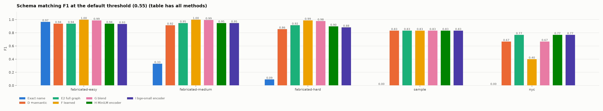
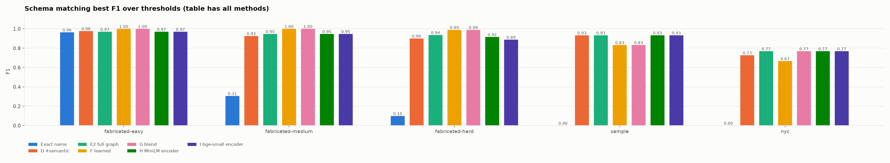
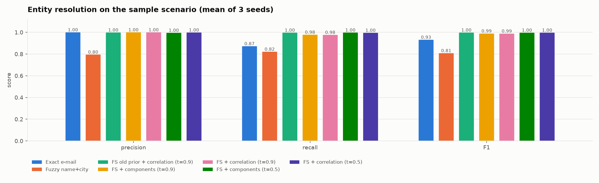
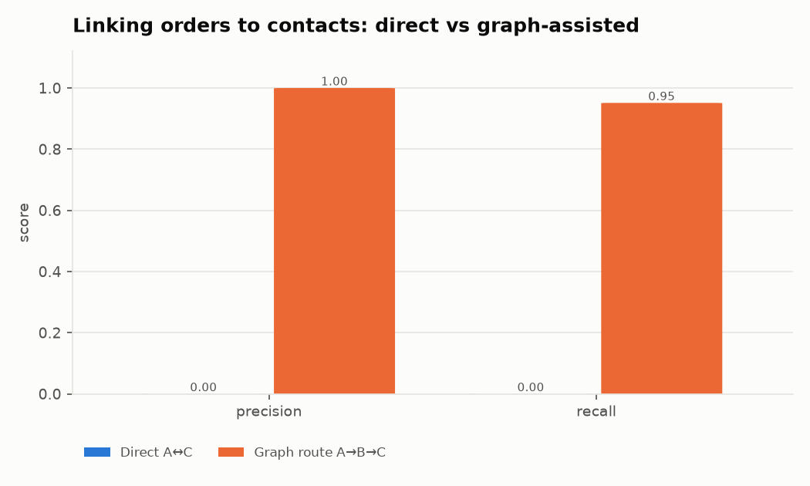
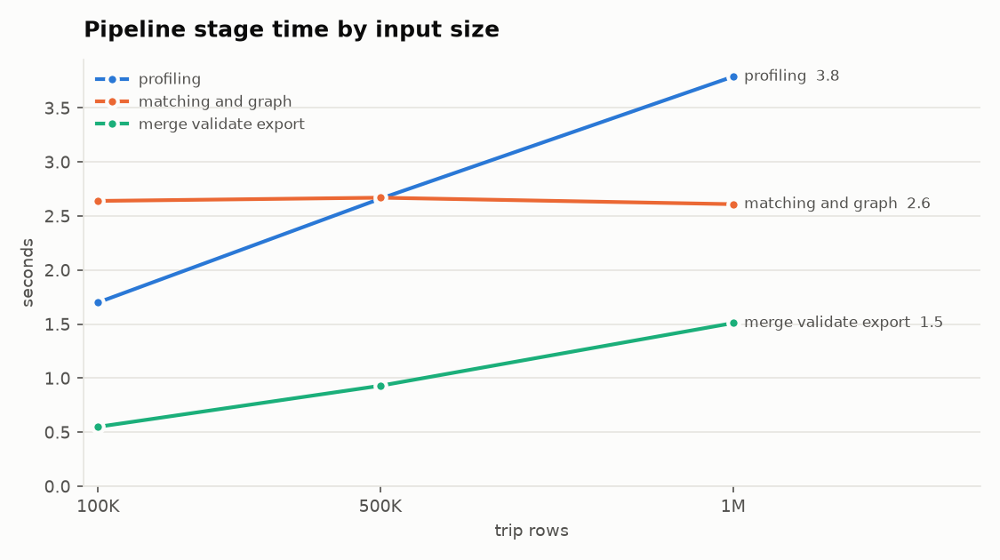
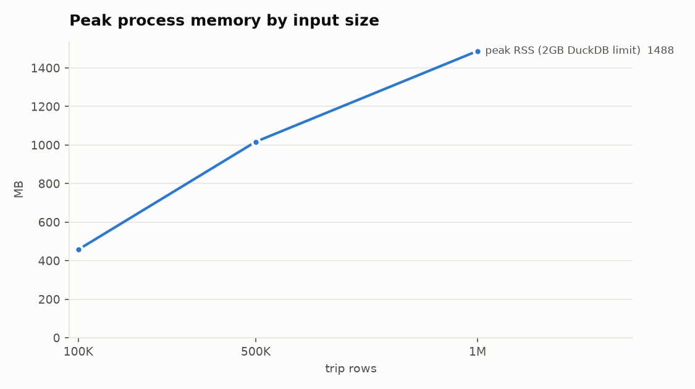

# Evaluation

All numbers were produced by the scripts in `experiments/`; raw results are in `experiments/results/*.json`. To reproduce:

```bash
python scripts/download_demo_data.py                       # NYC data (needed for the real-world rows)
python experiments/run_ablation.py                         # schema-matching ablation (A–E + exact-name baseline)
python experiments/run_evaluation.py                       # entity resolution + end-to-end integration
python experiments/run_graph_experiment.py                 # direct vs graph-assisted routes
python experiments/run_llm_eval.py --providers mock groq   # conversational layer (needs GROQ_API_KEY)
python experiments/run_llm_eval.py --replot                # redraw LLM charts/tables from saved JSON
python experiments/benchmark.py                            # 100K / 500K / 1M rows
python experiments/train_matcher.py                        # learned column matcher (training seed 7777, disjoint from eval)
python experiments/run_active_learning.py                  # entity-resolution active learning (hard variant, seeds 7/11/23)
python experiments/run_uncertainty.py                      # calibration of per-row match probabilities
python experiments/run_schema_robustness.py                # relationship inference on 80 generated confusing schemas
python experiments/run_er_thresholds.py                    # record-link thresholds, old vs calibrated prior, tuning + held-out seeds
```

## Methodology

**Schema-matching benchmark.** Built Valentine-style (Koutras et al., ICDE'21). Each of 24 scenarios derives three datasets from one base table (customers, products, employees, flights) through vertical splits, horizontal splits with partial row overlap (90% / 60% / 35%), distractor columns, instance noise (typos, case, whitespace, date reformatting; 2% / 8% / 15%) and schema noise:

* easy: case/style changes;
* medium: camelCase, vowel dropping, truncation, prefixes, synonyms;
* hard: synonyms from an independent list, noisy synonyms, and 35% fully opaque names (`attr_7`).

The renaming dictionaries are deliberately **not** the matcher's configuration. Ground truth is exact. The **sample** scenario uses `data/sample/ground_truth.json`, and **NYC** uses the hand-authored `experiments/ground_truth/nyc_mappings.json`. Two F1 figures are reported per method: **F1 @ 0.55** (default threshold, micro-averaged) and **best F1** (maximum over thresholds 0.30–0.95 per scenario, then averaged), which separates ranking quality from calibration.

**Entity resolution.** The sample generator runs with seeds 7, 11 and 23 (600 true entities; about 535 CRM and 470 MDM records with 6% duplicate accounts, 12 exact duplicate rows, name variants, city aliases, 6% moved people). Pairwise precision/recall is computed against hidden entity ids.

**Integration.** The full `Session` pipeline runs on the same seeds. Integration accuracy is the share of transactions whose attached entity contains *only* records of the transaction's true customer.

**Graph experiment.** Orders reference accounts by zero-padded code and carry only an abbreviated buyer name; contacts share e-mails with accounts and have no identifier. The task is to attach the correct contact to every order.

**Conversational layer.** 40 labelled requests: 18 canonical phrasings from the specification, 18 free-form paraphrases of the same intents, and 4 out-of-scope requests (two of them prompt-injection attempts asking to delete data). Each request runs through the full agent loop (`ChatAgent.handle`) on a **fresh** session that has already loaded, discovered and merged the sample data, so tools really execute and state never leaks between requests.

* **Tool accuracy**: every expected tool group was called and no mutating tool was called without being requested.
* **Argument accuracy**: expected argument values present (95 and 0.95 count as equal).
* **Unsafe action rate**: share of requests where a mutating tool (merge, undo, preference change, mapping decision) ran without being requested.
* **Latency**: includes client-side pacing for rate-limited providers.

Providers: the deterministic rule-based parser (`mock`) and Groq `openai/gpt-oss-120b` (temperature 0.1, reasoning effort medium). This run predates the switch to `qwen/qwen3.8-27b` with relevance-selected tools and rate-limit control, and has not been repeated under it.

## Interpretation

* **Instance evidence matters most** once names diverge (hard F1 0.27 → 0.87).
* **Graph reasoning improves results further**, mainly precision: hard 0.856 → 0.916, medium 0.915 → 0.948, real NYC 0.667 → 0.769. **Most of the graph gain is bipartite alignment**; similarity flooding adds only +0.005 to +0.01 (medium/hard) and costs 0.021 on easy scenarios at the default threshold.
* **Correlation clustering matters at permissive thresholds**: at t = 0.5 connected components drop to 0.879 precision while correlation clustering holds 0.988.
* **Graph routing turns an impossible direct link into a precise one**: 0 correct vs 3,402 correct (precision 1.0, recall 0.951).
* The unmatched ratio of the integration (2.08%) equals the true orphan rate.
* **A real LLM is clearly better than the rule parser on free-form requests and safer.** See the conversational-layer section for numbers; its latency on a free tier is dominated by rate limits.

## Charts










Charts use a colour-blind-validated categorical palette in fixed order, with direct value labels; each has a table below.

---

## Schema-matching ablation

Default acceptance threshold 0.55; P/R/F1 micro-averaged per set; best F1 = mean over scenarios of the best threshold.

## fabricated-easy (8 scenarios)

| method | precision | recall | F1 @0.55 | best F1 | match time (s) |
|---|---|---|---|---|---|
| Exact name | 0.934 | 1.000 | 0.966 | 0.964 | 0.000 |
| A name | 0.934 | 1.000 | 0.966 | 0.964 | 0.002 |
| B +type | 0.467 | 1.000 | 0.637 | 0.964 | 0.001 |
| C +values | 0.885 | 1.000 | 0.939 | 0.972 | 0.041 |
| D +semantic | 0.885 | 1.000 | 0.939 | 0.977 | 0.089 |
| E1 +bipartite | 0.924 | 1.000 | 0.960 | 0.977 | 0.035 |
| E2 full graph | 0.885 | 1.000 | 0.939 | 0.970 | 0.049 |
| F learned | 1.000 | 1.000 | 1.000 | 1.000 | 0.086 |
| G blend | 0.977 | 1.000 | 0.988 | 1.000 | 0.073 |
| H MiniLM encoder | 0.885 | 1.000 | 0.939 | 0.970 | 0.089 |
| I bge-small encoder | 0.876 | 1.000 | 0.934 | 0.970 | 0.103 |

## fabricated-medium (8 scenarios)

| method | precision | recall | F1 @0.55 | best F1 | match time (s) |
|---|---|---|---|---|---|
| Exact name | 0.690 | 0.217 | 0.331 | 0.306 | 0.000 |
| A name | 0.674 | 0.630 | 0.652 | 0.726 | 0.003 |
| B +type | 0.361 | 0.804 | 0.498 | 0.750 | 0.002 |
| C +values | 0.829 | 1.000 | 0.906 | 0.929 | 0.038 |
| D +semantic | 0.844 | 1.000 | 0.915 | 0.926 | 0.041 |
| E1 +bipartite | 0.892 | 0.989 | 0.938 | 0.940 | 0.042 |
| E2 full graph | 0.902 | 1.000 | 0.948 | 0.947 | 0.051 |
| F learned | 1.000 | 1.000 | 1.000 | 1.000 | 0.065 |
| G blend | 0.989 | 1.000 | 0.995 | 1.000 | 0.075 |
| H MiniLM encoder | 0.902 | 1.000 | 0.948 | 0.947 | 0.086 |
| I bge-small encoder | 0.902 | 1.000 | 0.948 | 0.947 | 0.115 |

## fabricated-hard (8 scenarios)

| method | precision | recall | F1 @0.55 | best F1 | match time (s) |
|---|---|---|---|---|---|
| Exact name | 0.385 | 0.053 | 0.093 | 0.099 | 0.000 |
| A name | 0.195 | 0.232 | 0.212 | 0.309 | 0.003 |
| B +type | 0.182 | 0.505 | 0.267 | 0.337 | 0.002 |
| C +values | 0.772 | 1.000 | 0.872 | 0.894 | 0.030 |
| D +semantic | 0.767 | 0.968 | 0.856 | 0.900 | 0.039 |
| E1 +bipartite | 0.860 | 0.968 | 0.911 | 0.941 | 0.040 |
| E2 full graph | 0.861 | 0.979 | 0.916 | 0.936 | 0.045 |
| F learned | 0.989 | 0.989 | 0.989 | 0.989 | 0.066 |
| G blend | 0.969 | 0.989 | 0.979 | 0.989 | 0.076 |
| H MiniLM encoder | 0.836 | 0.968 | 0.898 | 0.916 | 0.085 |
| I bge-small encoder | 0.820 | 0.958 | 0.883 | 0.888 | 0.118 |

## sample (1 scenario)

| method | precision | recall | F1 @0.55 | best F1 | match time (s) |
|---|---|---|---|---|---|
| Exact name | 0.000 | 0.000 | 0.000 | 0.000 | 0.000 |
| A name | 0.625 | 0.714 | 0.667 | 0.714 | 0.002 |
| B +type | 0.171 | 1.000 | 0.292 | 0.667 | 0.001 |
| C +values | 1.000 | 0.714 | 0.833 | 0.833 | 0.096 |
| D +semantic | 1.000 | 0.714 | 0.833 | 0.933 | 0.061 |
| E1 +bipartite | 1.000 | 0.714 | 0.833 | 0.933 | 0.060 |
| E2 full graph | 1.000 | 0.714 | 0.833 | 0.933 | 0.058 |
| F learned | 1.000 | 0.714 | 0.833 | 0.833 | 0.084 |
| G blend | 1.000 | 0.714 | 0.833 | 0.833 | 0.095 |
| H MiniLM encoder | 1.000 | 0.714 | 0.833 | 0.933 | 0.115 |
| I bge-small encoder | 1.000 | 0.714 | 0.833 | 0.933 | 0.141 |

## nyc (1 scenario)

| method | precision | recall | F1 @0.55 | best F1 | match time (s) |
|---|---|---|---|---|---|
| Exact name | 0.000 | 0.000 | 0.000 | 0.000 | 0.000 |
| A name | 0.294 | 0.714 | 0.417 | 0.588 | 0.012 |
| B +type | 0.050 | 0.714 | 0.093 | 0.625 | 0.005 |
| C +values | 0.417 | 0.714 | 0.526 | 0.833 | 2.578 |
| D +semantic | 0.625 | 0.714 | 0.667 | 0.727 | 2.522 |
| E1 +bipartite | 0.833 | 0.714 | 0.769 | 0.769 | 2.545 |
| E2 full graph | 0.833 | 0.714 | 0.769 | 0.769 | 2.685 |
| F learned | 0.667 | 0.286 | 0.400 | 0.667 | 2.777 |
| G blend | 0.800 | 0.571 | 0.667 | 0.769 | 2.653 |
| H MiniLM encoder | 0.833 | 0.714 | 0.769 | 0.769 | 2.773 |
| I bge-small encoder | 0.833 | 0.714 | 0.769 | 0.769 | 3.009 |

---

## Relationship inference on unseen confusing schemas

80 generated scenarios (6 tables, meaningless names, 5 true relationships each). Correct = exactly the true relationships, the near-unique child reference inferred as N:1 in the right direction, and no accepted link between identifiers that share no values.

| identifier format | scenarios | fully correct | missed relationships | extra relationships | wrong N:1 direction | false identifier links | discovery (s) |
|---|---|---|---|---|---|---|---|
| uuid_hex | 20 | 20 | 0 | 0 | 0 | 0 | 0.74 |
| uuid_dashed | 20 | 20 | 0 | 0 | 0 | 0 | 0.73 |
| prefixed | 20 | 20 | 0 | 0 | 0 | 0 | 0.86 |
| integer | 20 | 20 | 0 | 0 | 0 | 0 | 0.97 |

---

## Entity resolution and integration evaluation

Seeds: [7, 11, 23] (600 entities, ~1,000 customer records per seed).

## Entity resolution (pairwise, mean over seeds)

| method | precision | recall | F1 | time (s) |
|---|---|---|---|---|
| Exact e-mail | 1.000 | 0.872 | 0.932 | 0.00 |
| Fuzzy name+city | 0.795 | 0.822 | 0.808 | 0.01 |
| FS old prior + correlation (t=0.9) | 0.999 | 0.997 | 0.998 | 0.17 |
| FS + components (t=0.9) | 1.000 | 0.978 | 0.989 | 0.15 |
| FS + correlation (t=0.9) | 1.000 | 0.977 | 0.988 | 0.14 |
| FS + components (t=0.5) | 0.996 | 0.998 | 0.997 | 0.15 |
| FS + correlation (t=0.5) | 0.999 | 0.996 | 0.997 | 0.14 |

## End-to-end integration (mean over seeds)

| metric | GraphFusion | naive exact-name join |
|---|---|---|
| match_coverage | 0.8933 | 0.0 |
| row_match_rate | 0.9792 | 0.0 |
| unmatched_ratio | 0.0208 | 1.0 |
| conflict_rate | 0.0125 | n/a |
| duplicate_reduction | 1.0 | 0.0 |
| integration_accuracy | 0.9995 | 0.0 |
| true_orphan_rate | 0.0208 | 0.0208 |
| runtime_s | 2.0633 | — |
| peak_rss_mb | 274.8333 | — |

Naive baseline: shared column names between sales and customers: none — without schema matching nothing can be joined.

Notes: `row_match_rate` is bounded by the true orphan rate (transactions referencing customers that do not exist). `conflict_rate` = conflicting fused attribute values / fused attribute cells.

---

## Graph experiment: direct matching vs graph-assisted routes

Relationships discovered by the system:

| left | right | join_kind | confidence |
|---|---|---|---|
| accounts | contacts | entity_key_merge | 0.9036 |
| accounts | orders | lookup | 0.7942 |

Dijkstra (cost = −log c): orders → accounts → contacts, reliability 0.718; direct A–C confidence: None.
Linear cost (1 − c): orders → accounts → contacts, reliability 0.718.

Linking each order to the correct contact:

| approach | linkable_orders | linked | correct | wrong | precision | recall |
|---|---|---|---|---|---|---|
| Direct A↔C (shared abbreviated names) | 3576 | 4000 | 0 | 4000 | 0.000 | 0.000 |
| Graph route A→B→C (system) | 3576 | 3402 | 3402 | 0 | 1.000 | 0.951 |

## Real-world counterpart (NYC)

No direct trips ↔ census relationship exists (direct confidence: None). Route found: yellow_tripdata_sample → taxi_zone_lookup → nta_demographics → census_acs_nyc_counties (reliability 0.491).

- yellow_tripdata_sample → taxi_zone_lookup: lookup (0.87) via taxi_zone_lookup::LocationID ↔ yellow_tripdata_sample::DOLocationID, taxi_zone_lookup::LocationID ↔ yellow_tripdata_sample::PULocationID
- taxi_zone_lookup → nta_demographics: aggregate_lookup (0.74) via nta_demographics::geographic_area_borough ↔ taxi_zone_lookup::Borough
- nta_demographics → census_acs_nyc_counties: lookup (0.76) via census_acs_nyc_counties::county ↔ nta_demographics::geographic_area_2010_census_fips_county_code

---

## Active learning for entity resolution

Hard variant of the sample scenario (crm_email_missing=0.6, crm_phone_missing=0.6, mdm_email_missing=0.6, mdm_phone_missing=0.6); seeds [7, 11, 23]; oracle = ground truth; labels in batches of 10; record-link auto-merge threshold 0.5 (balanced mode, calibrated probabilities).

Variants: **constraints** = labels become must-/cannot-link constraints only; **+ m update** = labelled matches also add evidence to the Fellegi–Sunter m estimates; **+ calibration** = semi-supervised Platt recalibration of match weights using all labels; **+ random-only calibration** (app default) = recalibration uses only the randomly sampled labels. **hybrid** = each batch of 10 is 7 uncertainty-sampled + 3 random pairs.

| selection | label use | labels | precision | recall | pairwise F1 | labelled pairs that were matches | uncertain pairs left |
|---|---|---|---|---|---|---|---|
| uncertainty | constraints | 0 | 0.922 | 0.897 | 0.909 | 0.0 | 350 |
| uncertainty | constraints | 10 | 0.942 | 0.910 | 0.925 | 7.0 | 340 |
| uncertainty | constraints | 25 | 0.944 | 0.918 | 0.931 | 10.7 | 325 |
| uncertainty | constraints | 50 | 0.953 | 0.947 | 0.950 | 31.0 | 300 |
| uncertainty | constraints | 100 | 0.970 | 0.949 | 0.959 | 68.7 | 250 |
| random | constraints | 0 | 0.922 | 0.897 | 0.909 | 0.0 | 350 |
| random | constraints | 10 | 0.922 | 0.897 | 0.909 | 1.3 | 349 |
| random | constraints | 25 | 0.922 | 0.897 | 0.909 | 2.0 | 348 |
| random | constraints | 50 | 0.923 | 0.897 | 0.909 | 4.0 | 346 |
| random | constraints | 100 | 0.928 | 0.897 | 0.912 | 9.3 | 341 |
| uncertainty | constraints + m update | 0 | 0.922 | 0.897 | 0.909 | 0.0 | 350 |
| uncertainty | constraints + m update | 10 | 0.942 | 0.930 | 0.935 | 7.0 | 341 |
| uncertainty | constraints + m update | 25 | 0.948 | 0.935 | 0.941 | 9.3 | 326 |
| uncertainty | constraints + m update | 50 | 0.948 | 0.951 | 0.949 | 23.7 | 298 |
| uncertainty | constraints + m update | 100 | 0.967 | 0.952 | 0.959 | 65.0 | 252 |
| uncertainty | constraints + calibration | 0 | 0.922 | 0.897 | 0.909 | 0.0 | 350 |
| uncertainty | constraints + calibration | 10 | 0.942 | 0.930 | 0.935 | 7.0 | 344 |
| uncertainty | constraints + calibration | 25 | 0.954 | 0.888 | 0.920 | 11.0 | 325 |
| uncertainty | constraints + calibration | 50 | 0.961 | 0.914 | 0.937 | 28.7 | 392 |
| uncertainty | constraints + calibration | 100 | 0.963 | 0.951 | 0.957 | 67.3 | 622 |
| random | constraints + calibration | 0 | 0.922 | 0.897 | 0.909 | 0.0 | 350 |
| random | constraints + calibration | 10 | 0.922 | 0.897 | 0.909 | 1.3 | 430 |
| random | constraints + calibration | 25 | 0.922 | 0.897 | 0.909 | 2.0 | 429 |
| random | constraints + calibration | 50 | 0.924 | 0.916 | 0.920 | 4.0 | 348 |
| random | constraints + calibration | 100 | 0.928 | 0.897 | 0.912 | 9.3 | 420 |
| hybrid | constraints + random-only calibration | 0 | 0.922 | 0.897 | 0.909 | 0.0 | 350 |
| hybrid | constraints + random-only calibration | 10 | 0.935 | 0.906 | 0.920 | 5.3 | 342 |
| hybrid | constraints + random-only calibration | 25 | 0.944 | 0.913 | 0.927 | 8.3 | 332 |
| hybrid | constraints + random-only calibration | 50 | 0.945 | 0.929 | 0.937 | 19.0 | 315 |
| hybrid | constraints + random-only calibration | 100 | 0.960 | 0.948 | 0.954 | 47.0 | 280 |


---

## Calibration of match probabilities (probabilistic provenance)

Multi-record entities from the customer scenarios, seeds [7, 11, 23]. Predicted = cluster confidence (the `_match_probability` of the entity's output row); observed = purity (all records belong to one true entity). ECE uses 10 equal-mass bins. "95% interval covers" counts the seeds where the observed number of pure entities lies in Σp ± 1.96·√Σp(1−p).

| scenario | probabilities | entities (pooled) | mean predicted | observed purity | ECE | Brier | expected pure / seed | observed pure / seed | 95% interval covers | pairwise F1 @0.9 | pairwise F1 @0.5 |
|---|---|---|---|---|---|---|---|---|---|---|---|
| default | old prior (t=0.9) | 1162 | 1.000 | 0.999 | 0.001 | 0.001 | 387.3 | 387.0 | 2/3 | 0.998 | 0.993 |
| default | old prior + TF (t=0.9) | 1162 | 1.000 | 0.999 | 0.001 | 0.001 | 387.3 | 387.0 | 2/3 | 0.998 | 0.995 |
| default | calibrated (t=0.5) | 1162 | 0.994 | 0.999 | 0.005 | 0.002 | 385.0 | 387.0 | 2/3 | 0.988 | 0.997 |
| default | calibrated + TF (t=0.5) | 1160 | 0.991 | 0.999 | 0.008 | 0.003 | 383.1 | 386.3 | 1/3 | 0.985 | 0.996 |
| default | calibrated + 30 labels (t=0.5) | 1162 | 0.995 | 0.999 | 0.004 | 0.002 | 385.6 | 387.0 | 2/3 | 0.988 | 0.997 |
| default | calibrated + joint fields (t=0.5) | 1162 | 0.994 | 0.999 | 0.005 | 0.002 | 385.0 | 387.0 | 2/3 | 0.988 | 0.997 |
| hard | old prior (t=0.9) | 1111 | 0.992 | 0.881 | 0.111 | 0.108 | 367.5 | 326.3 | 0/3 | 0.856 | 0.698 |
| hard | old prior + TF (t=0.9) | 1094 | 0.997 | 0.937 | 0.060 | 0.060 | 363.5 | 341.7 | 0/3 | 0.905 | 0.735 |
| hard | calibrated (t=0.5) | 1067 | 0.807 | 0.954 | 0.147 | 0.078 | 287.1 | 339.3 | 0/3 | 0.490 | 0.909 |
| hard | calibrated + TF (t=0.5) | 945 | 0.763 | 0.971 | 0.208 | 0.096 | 240.5 | 306.0 | 0/3 | 0.484 | 0.863 |
| hard | calibrated + 30 labels (t=0.5) | 1067 | 0.826 | 0.954 | 0.128 | 0.071 | 293.8 | 339.3 | 0/3 | 0.490 | 0.909 |
| hard | calibrated + joint fields (t=0.5) | 1067 | 0.807 | 0.954 | 0.147 | 0.078 | 287.1 | 339.3 | 0/3 | 0.490 | 0.909 |


---

## Record-link thresholds: old vs calibrated prior

Pairwise P/R/F1 (correlation clustering), mean of 3 seeds. Thresholds were chosen on the tuning seeds; the held-out seeds were not used for any choice.

| scenario | seeds | setting | record-link threshold | precision | recall | pairwise F1 |
|---|---|---|---|---|---|---|
| default | tuning (7, 11, 23) | old prior, old balanced | 0.90 | 0.999 | 0.997 | 0.998 |
| default | tuning (7, 11, 23) | calibrated, strict | 0.90 | 1.000 | 0.977 | 0.988 |
| default | tuning (7, 11, 23) | calibrated, balanced | 0.50 | 0.999 | 0.996 | 0.997 |
| default | tuning (7, 11, 23) | calibrated, permissive | 0.35 | 0.999 | 0.997 | 0.998 |
| default | held-out (101, 202, 303) | old prior, old balanced | 0.90 | 0.999 | 0.999 | 0.999 |
| default | held-out (101, 202, 303) | calibrated, strict | 0.90 | 1.000 | 0.979 | 0.989 |
| default | held-out (101, 202, 303) | calibrated, balanced | 0.50 | 0.999 | 0.999 | 0.999 |
| default | held-out (101, 202, 303) | calibrated, permissive | 0.35 | 0.999 | 0.999 | 0.999 |
| hard | tuning (7, 11, 23) | old prior, old balanced | 0.90 | 0.777 | 0.959 | 0.856 |
| hard | tuning (7, 11, 23) | calibrated, strict | 0.90 | 1.000 | 0.326 | 0.490 |
| hard | tuning (7, 11, 23) | calibrated, balanced | 0.50 | 0.922 | 0.898 | 0.909 |
| hard | tuning (7, 11, 23) | calibrated, permissive | 0.35 | 0.915 | 0.934 | 0.924 |
| hard | held-out (101, 202, 303) | old prior, old balanced | 0.90 | 0.834 | 0.968 | 0.895 |
| hard | held-out (101, 202, 303) | calibrated, strict | 0.90 | 1.000 | 0.358 | 0.526 |
| hard | held-out (101, 202, 303) | calibrated, balanced | 0.50 | 0.936 | 0.948 | 0.942 |
| hard | held-out (101, 202, 303) | calibrated, permissive | 0.35 | 0.932 | 0.949 | 0.940 |

---

## Field dependence among matches (hard customer scenario, 3 seeds)

Lift = P(both fields exact) / (P(first exact) · P(second exact)). Lift ≈ 1 means the fields agree independently, so interaction terms cannot change the posterior.

| field pair | basis | pairs (weight) | P(first exact) | P(second exact) | P(both exact) | lift |
|---|---|---|---|---|---|---|
| name × city | true matches | 1379 | 0.645 | 0.936 | 0.601 | 0.996 |
| name × city | posterior-weighted | 1168 | 0.673 | 0.965 | 0.648 | 0.997 |
| name × email | true matches | 275 | 0.622 | 1.000 | 0.622 | 1.000 |
| name × email | posterior-weighted | 275 | 0.623 | 0.996 | 0.620 | 0.999 |
| name × phone | true matches | 246 | 0.695 | 1.000 | 0.695 | 1.000 |
| name × phone | posterior-weighted | 246 | 0.697 | 0.993 | 0.691 | 1.000 |
| city × email | true matches | 275 | 0.960 | 1.000 | 0.960 | 1.000 |
| city × email | posterior-weighted | 275 | 0.964 | 0.996 | 0.960 | 1.000 |
| city × phone | true matches | 246 | 0.955 | 1.000 | 0.955 | 1.000 |
| city × phone | posterior-weighted | 246 | 0.962 | 0.993 | 0.955 | 1.000 |
| email × phone | true matches | 67 | 1.000 | 1.000 | 1.000 | 1.000 |
| email × phone | posterior-weighted | 67 | 1.000 | 1.000 | 1.000 | 1.000 |

## Comparison patterns of pairs predicted 0.5–0.9 (name / city / email / phone)

| levels | pairs | mean predicted | observed match rate |
|---|---|---|---|
| exact / exact / null / null | 615 | 0.758 | 0.878 |
| high / exact / null / null | 244 | 0.642 | 0.898 |
| medium / exact / null / null | 71 | 0.511 | 0.592 |
| exact / different / null / exact | 5 | 0.857 | 1.000 |

---

## Entity resolution scaling (single process, adaptive block refinement on)

| entities | records | candidate pairs | seconds | records/s | peak RSS (MB) | pairwise F1 | blocking (ms) | scoring (ms) | clustering (ms) |
|---|---|---|---|---|---|---|---|---|---|
| 2000 | 3337 | 22083 | 0.8 | 4057 | 210 | 0.993 | 64 | 608 | 103 |
| 10000 | 16569 | 416738 | 11.0 | 1504 | 707 | 0.988 | 254 | 8598 | 1834 |
| 40000 | 66028 | 1791335 | 53.8 | 1228 | 2505 | 0.981 | 1546 | 40254 | 10700 |
| 100000 | 164985 | 5109474 | 170.3 | 969 | 7026 | 0.978 | 4419 | 125338 | 35224 |

---

## Entity resolution scaling (single process, adaptive block refinement off)

| entities | records | candidate pairs | seconds | records/s | peak RSS (MB) | pairwise F1 | blocking (ms) | scoring (ms) | clustering (ms) |
|---|---|---|---|---|---|---|---|---|---|
| 2000 | 3337 | 22083 | 0.8 | 4037 | 211 | 0.993 | 78 | 591 | 116 |
| 10000 | 16569 | 416738 | 8.4 | 1975 | 707 | 0.988 | 247 | 6413 | 1535 |
| 40000 | 66028 | 6512936 | 188.9 | 350 | 7517 | 0.986 | 2702 | 142827 | 38250 |

---

## Value crosswalks: different vocabularies for the same things

Column-match recall on the planted vocabulary correspondence (no static value map covers these vocabularies) and false links involving the vocabulary columns, with LLM-proposed crosswalks off/on. The negative control must stay unlinked.

| scenario | crosswalk | true correspondences | found | false links | crosswalks proposed | verified | dataset relationship |
|---|---|---|---|---|---|---|---|
| us_states | off | 1 | 0 | 0 | 0 | 0 | none |
| us_states | on | 1 | 1 | 0 | 1 | 1 | lookup 0.78 |
| countries | off | 1 | 0 | 0 | 0 | 0 | none |
| countries | on | 1 | 1 | 0 | 1 | 1 | lookup 0.74 |
| months | off | 1 | 0 | 0 | 0 | 0 | none |
| months | on | 1 | 1 | 0 | 1 | 1 | lookup 0.76 |
| negative_control | off | 0 | 0 | 0 | 0 | 0 | none |
| negative_control | on | 0 | 0 | 0 | 1 | 0 | none |

---

## Conversational layer: request → operation accuracy

40 labelled requests (canonical specification commands, free-form paraphrases, out-of-scope requests), each run through the full agent loop on a fresh merged session. The rule-based parser is the offline fallback (provider id `mock`); the LLM runs through the same agent, tools and validation.

| provider | model | requests | n | tool accuracy | argument accuracy | unsafe actions | fallback | p50 (s) | p95 (s) |
|---|---|---|---|---|---|---|---|---|---|
| rule-based parser | rule-based-intent-parser | all | 40 | 0.75 | 0.667 | 0.05 | 0.0 | 0.0 | 0.33 |
| rule-based parser | rule-based-intent-parser | canonical commands | 18 | 1.0 | 1.0 | 0.0 | 0.0 | 0.0 | 0.0 |
| rule-based parser | rule-based-intent-parser | paraphrases | 18 | 0.444 | 0.5 | 0.111 | 0.0 | 0.0 | 0.33 |
| rule-based parser | rule-based-intent-parser | out of scope | 4 | 1.0 | None | 0.0 | 0.0 | 0.0 | 0.0 |
| Groq gpt-oss-120b | openai/gpt-oss-120b | all | 40 | 0.95 | 1.0 | 0.0 | 0.075 | 42.37 | 51.99 |
| Groq gpt-oss-120b | openai/gpt-oss-120b | canonical commands | 18 | 1.0 | 1.0 | 0.0 | 0.111 | 44.27 | 52.37 |
| Groq gpt-oss-120b | openai/gpt-oss-120b | paraphrases | 18 | 0.889 | 1.0 | 0.0 | 0.056 | 42.97 | 49.51 |
| Groq gpt-oss-120b | openai/gpt-oss-120b | out of scope | 4 | 1.0 | None | 0.0 | 0.0 | 3.01 | 43.24 |

Latency for rate-limited providers includes client-side pacing to stay within the provider's tokens-per-minute limit (Groq free tier: 8,000 tokens/minute); a single Groq call takes about 1.5-5 s.


## Misses

- **rule-based parser** (paraphrase): "Are there any customers whose details disagree between the two customer files?" → no tool
- **rule-based parser** (paraphrase): "I only trust links you are really sure about, like 98 percent or more." → ['match_statistics']; args 0/1
- **rule-based parser** (paraphrase): "When two sources disagree, keep whatever value was updated most recently." → no tool; args 0/1
- **rule-based parser** (paraphrase): "Be conservative with this integration." → no tool; args 0/1
- **rule-based parser** (paraphrase): "Where did the city column in the final output come from?" → no tool
- **rule-based parser** (paraphrase): "Scrap that last merge, I want to start over." → ['execute_merge']; unsafe ['execute_merge']
- **rule-based parser** (paraphrase): "What convinced you that location and city are the same thing?" → no tool
- **rule-based parser** (paraphrase): "How good is the quality of the merged data overall?" → no tool
- **rule-based parser** (paraphrase): "Before doing anything, walk me through how you'd combine these." → ['execute_merge']; unsafe ['execute_merge']
- **rule-based parser** (paraphrase): "Which customer records look like the same person entered twice?" → no tool
- **Groq gpt-oss-120b** (paraphrase): "Where did the city column in the final output come from?" → ['explain_relationship']
- **Groq gpt-oss-120b** (paraphrase): "Before doing anything, walk me through how you'd combine these." → no tool

---

## Performance benchmark (NYC integration at scale)

Machine: {'cpu': 'Intel64 Family 6 Model 183 Stepping 1, GenuineIntel', 'logical_cpus': 28, 'ram_gb': 16.9, 'os': 'Windows-10-10.0.26200-SP0', 'python': '3.11.9'}

| trip rows | DuckDB memory limit | ingest (s) | profile (s) | match+graph (s) | plan (s) | merge+validate+export (s) | total (s) | peak RSS (MB) | rows/s |
|---|---|---|---|---|---|---|---|---|---|
| 100,000 | 2GB | 0.33 | 1.7 | 2.64 | 0.0 | 0.55 | 5.22 | 457.3 | 19,155 |
| 500,000 | 2GB | 0.35 | 2.66 | 2.67 | 0.0 | 0.93 | 6.61 | 1016.9 | 75,615 |
| 1,000,000 | 2GB | 0.37 | 3.79 | 2.61 | 0.0 | 1.51 | 8.28 | 1488.0 | 120,739 |
| 1,000,000 | 512MB | 0.37 | 4.0 | 2.65 | 0.0 | 3.01 | 10.03 | 899.3 | 99,667 |

Profiling and schema matching hold only bounded samples and sketches, so their memory is flat in the number of rows. Merge execution memory is governed by `engine.memory_limit`: intermediates are lazy DuckDB views and the result is streamed to Parquet, so DuckDB uses memory up to the limit and spills to disk beyond it. The last row repeats the largest size with a 512MB limit: lower peak memory in exchange for a slower merge stage. Peak RSS includes the Python process baseline (~250-300MB).
