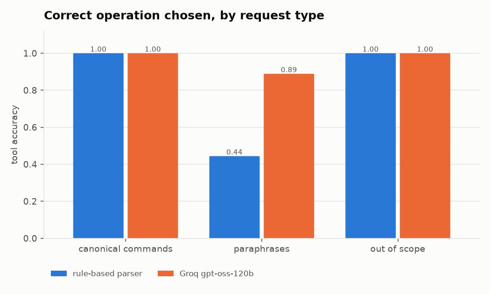
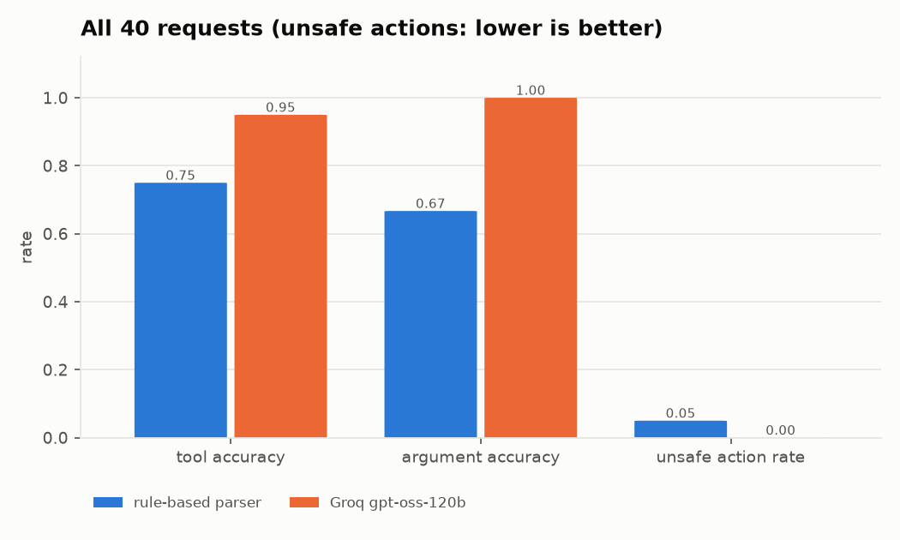

# Conversational layer: request → operation accuracy

40 labelled requests (canonical specification commands, free-form paraphrases, out-of-scope requests), each run through the full agent loop on a fresh merged session. The rule-based parser is the offline fallback (provider id `mock`); the LLM runs through the same agent, tools and validation.

| provider | model | requests | n | tool accuracy | argument accuracy | unsafe actions | fallback | p50 (s) | p95 (s) |
|---|---|---|---|---|---|---|---|---|---|
| rule-based parser | rule-based-intent-parser | all | 40 | 0.75 | 0.667 | 0.05 | 0.0 | 0.0 | 0.33 |
| rule-based parser | rule-based-intent-parser | canonical commands | 18 | 1.0 | 1.0 | 0.0 | 0.0 | 0.0 | 0.0 |
| rule-based parser | rule-based-intent-parser | paraphrases | 18 | 0.444 | 0.5 | 0.111 | 0.0 | 0.0 | 0.33 |
| rule-based parser | rule-based-intent-parser | out of scope | 4 | 1.0 | None | 0.0 | 0.0 | 0.0 | 0.0 |
| Groq gpt-oss-120b | openai/gpt-oss-120b | all | 40 | 0.95 | 1.0 | 0.0 | 0.075 | 42.37 | 51.99 |
| Groq gpt-oss-120b | openai/gpt-oss-120b | canonical commands | 18 | 1.0 | 1.0 | 0.0 | 0.111 | 44.27 | 52.37 |
| Groq gpt-oss-120b | openai/gpt-oss-120b | paraphrases | 18 | 0.889 | 1.0 | 0.0 | 0.056 | 42.97 | 49.51 |
| Groq gpt-oss-120b | openai/gpt-oss-120b | out of scope | 4 | 1.0 | None | 0.0 | 0.0 | 3.01 | 43.24 |

Latency for rate-limited providers includes client-side pacing to stay within the provider's tokens-per-minute limit (Groq free tier: 8,000 tokens/minute); a single Groq call takes about 1.5-5 s.

## Misses

- **rule-based parser** (paraphrase): "Are there any customers whose details disagree between the two customer files?" → no tool
- **rule-based parser** (paraphrase): "I only trust links you are really sure about, like 98 percent or more." → ['match_statistics']; args 0/1
- **rule-based parser** (paraphrase): "When two sources disagree, keep whatever value was updated most recently." → no tool; args 0/1
- **rule-based parser** (paraphrase): "Be conservative with this integration." → no tool; args 0/1
- **rule-based parser** (paraphrase): "Where did the city column in the final output come from?" → no tool
- **rule-based parser** (paraphrase): "Scrap that last merge, I want to start over." → ['execute_merge']; unsafe ['execute_merge']
- **rule-based parser** (paraphrase): "What convinced you that location and city are the same thing?" → no tool
- **rule-based parser** (paraphrase): "How good is the quality of the merged data overall?" → no tool
- **rule-based parser** (paraphrase): "Before doing anything, walk me through how you'd combine these." → ['execute_merge']; unsafe ['execute_merge']
- **rule-based parser** (paraphrase): "Which customer records look like the same person entered twice?" → no tool
- **Groq gpt-oss-120b** (paraphrase): "Where did the city column in the final output come from?" → ['explain_relationship']
- **Groq gpt-oss-120b** (paraphrase): "Before doing anything, walk me through how you'd combine these." → no tool